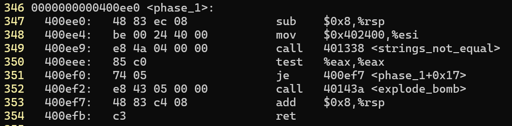
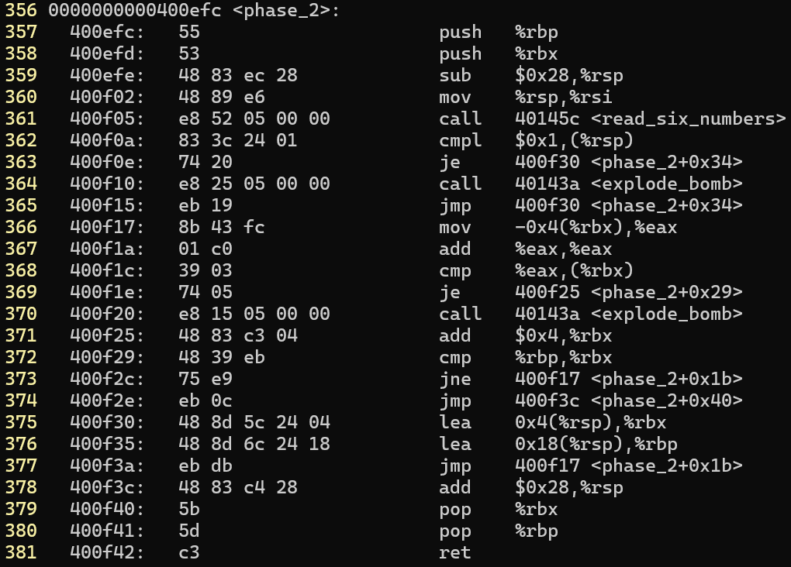
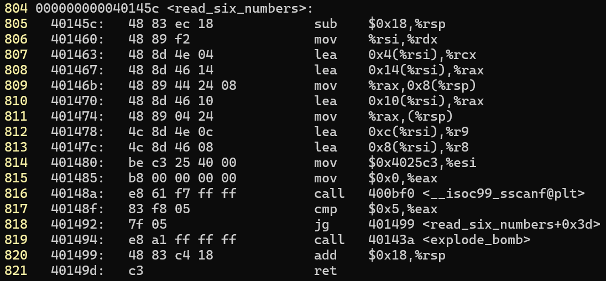
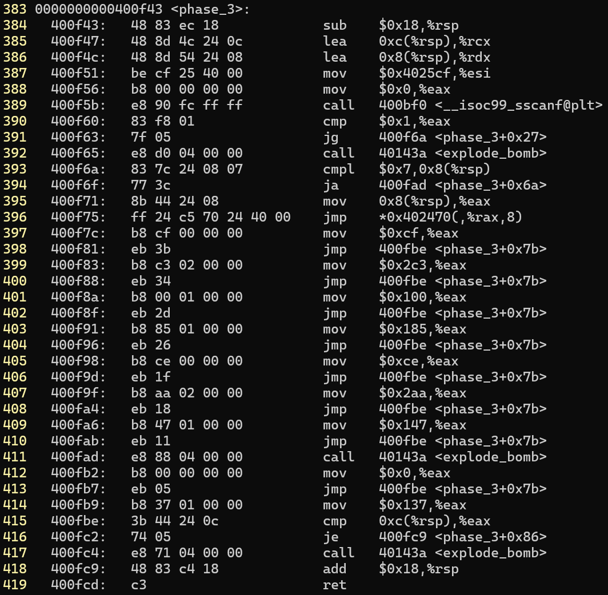
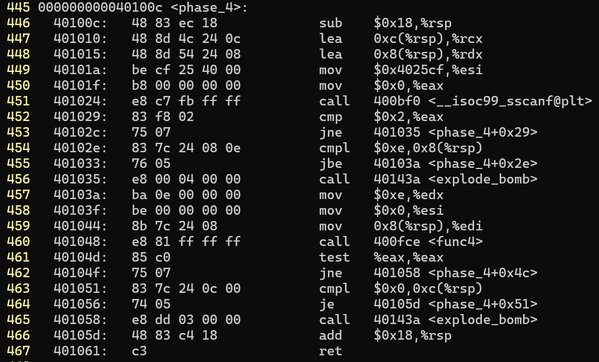
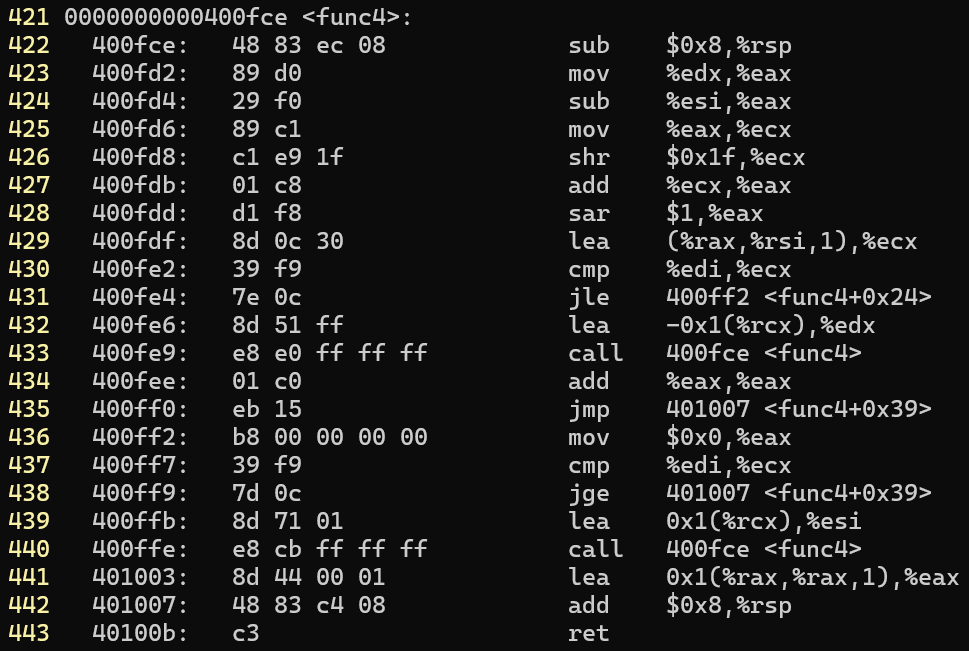

# bomblab

### 实验要求

实验资料: https://csapp.cs.cmu.edu/3e/labs.html bomblab [Self-Study Handout](https://csapp.cs.cmu.edu/3e/bomb.tar)

实验目标: 执行 bomb 二进制文件, 输入每个阶段对应的字符串来拆除炸弹

实验流程:

1.   查看 bomb.c 文件, 熟悉整体流程
2.   反汇编 bomb 文件, 查看每个阶段的汇编代码
3.   将字符串保存在文本文件里, 用文本文件作为二进制文件的输入

### 准备工作

反汇编, 默认为 AT&T 格式汇编

```bash
objdump -d bomb > bomb.dump
```

创建记录字符串的文本文件

```bash
touch res.txt
```

### ABI

CSAPP 中的汇编 = x86-64 ISA + AT&T 汇编语法 + Linux x86-64 System V ABI

Application Binary Interface ABI 应用二进制接口: 规定函数在机器码层面的调用规则

### phase_1

参数 input

找出使 `string_not_equal(input, answer)` 返回 `0` 的字符串 `answer`



等价 C 代码

```C
void (char *input)
{
    if (string_not_equal(input, "...") != 0)
        explode_bomb();
}
```

| 寄存器 |            含义             |
| :----: | :-------------------------: |
| `%rdi` | 用户输入字符串 `input` 地址 |
| `%rsi` |  正确字符串地址`0x402400`   |
| `eax`  | `strings_not_equal` 返回值  |

`sub 8, rsp` 调用 `phase_1` 前栈 16 字节对齐, call 压入返回地址 8 字节, 此时 rsp = 16n + 8, 所以进入函数后调用 call 前手动将 rsp 减去 8

`mov ..., esi` 设置 string_not_equal  第二个参数, rdi 为调用 phase_1 的字符串, 也就是输入字符串, rsi 为正确字符串, string_not_equal 判断二者是否相等, 相等返回 0

`je ...` 如果 `rax` 等于 0 则跳过 `call explode_bomb` 执行 `add 8, rsp`, 即跳过炸弹爆炸的代码

正确字符串地址为 `0x402400`  gdb 运行 bomb 时使用 `x/s 0x402400` 命令可用字符串格式查看该地址的内容, 即

```C
Border relations with Canada have never been better.
```

### phase_2

**phase_2**

参数 input

输入 6 个正确的整数



等价 C 代码

```C
void phase_2(char *input)
{
    int num[6];
    
    read_six_numbers(input, num);
    
    if (num[0] != 1) 
        explode_bomb();
    
    for (int i = 1; i < 6; i++)
        if (num[i] != 2 * num[i - 1])
            explode_bomb();
}
```

栈上分配 40 字节的空间(`rsp -= 40`)

再将 rsp 的值赋值给 rsi 作为 read_six_numbers 的第二个参数, 第一个参数是 rdi = input

read_six_numbers 会从 input 读取 6 个 4 字节整数到 `rsp[0] ~ rsp[20]`, 读取失败就爆炸

`cmpl $0x1,(%rsp)` 将 num[0] 与 1 比较, 不相等就爆炸, 即第一个数必须为 1

相等就跳转到 `0x400f30`

```assembly
lea 0x4(%rsp),%rbx
lea 0x18(%rsp),%rbp
```

rbx 记录 num[1] 地址 rbp 记录结尾地址, 跳转到 `0x400f17` 循环判断其余元素

```assembly
mov -0x4(%rbx),%eax
add %eax,%eax
cmp %eax,(%rbx)
je 400f25 <phase_2+0x29>
call 40143a <explode_bomb>

add $0x4,%rbx
cmp %rbp,%rbx
jne 400f17
jmp 400f3c
```

循环体:

将上一元素值赋给 eax

eax 翻倍

比较 eax 与当前元素值

不相等就爆炸, 相等就 rbx + 4 再进行循环条件判断, 即判断 rbx 与 rbp 是否相等, 不相等就执行循环体, 相等就跳转到结尾

**read_six_numbers**

参数 rdi = input  rsi = rsp



等价 C 代码

```C
void read_six_numbers(char *input, int *num)
{
    if (sscanf(input, "%d %d %d %d %d %d",
              &num[0], &num[1], &num[2],
              &num[3], &num[4], &num[5]) != 6)
        explode_bomb();
}
```

`sub $0x18, %rsp` 16 字节用于传入 sscanf 的第 7 第 8 个参数, 8 字节用于对齐

接下来的一大段内容用于保存 6 个数字的地址, 同时也是传入 sscanf 的后 6 个参数

```C
&num[0] = rdx = rsi
&num[1] = rcx = rsi + 4
&num[2] = r8 = rsi + 8
&num[3] = r9 = rsi + 12
&num[4] = rsp = rsi + 16
&num[5] = rsp + 8 = rsi + 20
```

传入 sscanf 的前 2 个参数为 `rdi = input` `rsi = 0x4025c3 = "%d %d %d %d %d %d"`

`sscanf` 从 `rdi(input)` 中按照 `rsi(format)` 给定的格式读取内容到给定的地址(`&num[0] ~ &num[5]`) 如果读取参数的数量少于 6 个就爆炸

### phase_3

参数 input

输入 2 个正确的整数



等价 C 代码

```C
void phase_3(char *input)
{
    int idx, val;
    
    if (sscanf(input, "%d %d", &idx, &val) != 2)
        explode_bomb();
    
    if ((unsigned)idx > 7)
        explode_bomb();
    
    int t;
    switch (idx)
    {
    	case 0: t = 0xcf; break;
        case 1: t = 0x137; break;
        case 2: t = 0x2c3; break;
        case 3: t = 0x100; break;
        case 4: t = 0x185; break;
        case 5: t = 0xce; break;
        case 6: t = 0x2aa; break;
        case 7: t = 0x147; break;
        default: explode_bomb();
    }
    
    if (val != t)
        explode_bomb();
}
```

汇编

```assembly
phase_3:
    sub    $0x18,%rsp
    lea    0xc(%rsp),%rcx		# 第二个元素
    lea    0x8(%rsp),%rdx		# 第一个元素
    mov    $0x4025cf,%esi		# "%d %d" 格式
    mov    $0x0,%eax
    call   __isoc99_sscanf@plt	# 返回读取成功的元素个数
    cmp    $0x1,%eax
    jg     success_read			# 返回值大于 1 个说明读取成功
    call   explode_bomb

success_read:
    cmpl   $0x7,0x8(%rsp)		# 比较第一个元素与 7 
    ja     explode_bomb			# 大于 7 就爆炸
    mov    0x8(%rsp),%eax		# rax = num[0]
    jmp    *0x402470(,%rax,8)	# switch(rax)

case_0:
    mov    $0xcf,%eax	# 207
    jmp    check

case_2:
    mov    $0x2c3,%eax	# 707
    jmp    check

case_3:
    mov    $0x100,%eax	# 256
    jmp    check

case_4:
    mov    $0x185,%eax	# 389
    jmp    check

case_5:
    mov    $0xce,%eax	# 206
    jmp    check

case_6:
    mov    $0x2aa,%eax	# 682
    jmp    check

case_7:
    mov    $0x147,%eax	# 327
    jmp    check

explode_bomb_case:
    call   explode_bomb
    mov    $0x0,%eax
    jmp    check

case_1:
    mov    $0x137,%eax	# 311

check:
    cmp    0xc(%rsp),%eax
    je     done
    call   explode_bomb

done:
    add    $0x18,%rsp
    ret
```

在 gdb 中查看 `0x402470` 地址开头的以 8 字节为单位的 8 个值

```assembly
0x402470:  0x0000000000400f7c case0  0x0000000000400fb9 case1
0x402480:  0x0000000000400f83 case2  0x0000000000400f8a case3
0x402490:  0x0000000000400f91 case4  0x0000000000400f98 case5
0x4024a0:  0x0000000000400f9f case6  0x0000000000400fa6 case7
```

所以只需要从这 8 组数中任选一组即可拆除炸弹

```C
0 207
1 311
2 707
3 256
4 389
5 206
6 682
7 327
```

### phase_4

**phase_4**

参数 input



等价 C 代码

```C
void phase_4(char *input)
{
    int num1, num2;
    
    if (sscanf(input, "%d %d", &num1, &num2) != 2)
        explode_bomb();
    
    if ((unsigned)num1 > 14)
        explode_bomb();
    
    if (func4(num1, 0, 14) != 0)
        explode_bomb();
    
    if (num2 != 0)
        explode_bomb();
}
```

前 8 条指令与 phase_3 类似, 从 input 中读取 2 个 4 字节整数到 rsp + 8 和 rsp + 12 中

无符号比较 rsp + 8 与 14, 若小于等于就正常, 否则就爆炸

紧接着准备传入 func4 的参数, 分别是

| 参数 |    含义    |
| :--: | :--------: |
| rdi  | *(rsp + 8) |
| rsi  |     0      |
| rdx  |     14     |

func4 返回值不等于 0 就爆炸, 等于 0 就正常

比较第二个参数与 0, 不等于 0 就爆炸, 等于 0 就正常



汇编

```assembly
func4:
    sub    $0x8,%rsp
    mov    %edx,%eax
    sub    %esi,%eax			# rax = rdx - rsi
    mov    %eax,%ecx
    shr    $0x1f,%ecx			# sign = (unsigned)rax >> 31
    add    %ecx,%eax
    sar    $1,%eax				# rax = (rax + sign) / 2
    							# rax = (rdx - rsi + sign) / 2 向 0 取整
    lea    (%rax,%rsi,1),%ecx	# rcx = rax + rsi = rsi + (rdx - rsi + sign) / 2
    cmp    %edi,%ecx			# if (rcx <= rdi) 即 (mid <= num)
    jle    less_or_equal				jmp less_or_equal
    lea    -0x1(%rcx),%edx		# else return func4(num, low, mid - 1) * 2;
    call   func4
    add    %eax,%eax
    jmp    done

less_or_equal:
    mov    $0x0,%eax
    cmp    %edi,%ecx		
    jge    done					# if (mid == num) return 0;
    lea    0x1(%rcx),%esi		# else return 2 * func4(num, mid + 1, high) + 1;
    call   func4
    lea    0x1(%rax,%rax,1),%eax

done:
    add    $0x8,%rsp
    ret
```

等价 C 代码

```C
int func4(int tar, int l, int r)
{
    int mid = l + (r - l) / 2;
    
    if (tar < mid) return 2 * func4(int tar, l, mid - 1);
    
    if (tar == mid) return 0;
    
    if (tar > mid) return 2 * func4(tar, mid + 1, r) + 1;
}
```

也就是说, 二分查找不能走右分支, 否则返回值不为 0 爆炸

满足条件的第一个元素为 0 1 3 7

第二个元素为 0, 则满足条件的组合有

```C
0 0
1 0
3 0
7 0
```

### phase_5

参数 input


汇编

```assembly
<phase_5>:
    push   %rbx						# 对齐 + 被调用者保存寄存器
    sub    $0x20,%rsp				# 分配 32 字节栈空间
    mov    %rdi,%rbx				# rbx = rdi = input
    mov    %fs:0x28,%rax			# 取出栈溢出检测值
    mov    %rax,0x18(%rsp)			# 放置栈溢出检测值
    xor    %eax,%eax
    call   40131b <string_length>	# rax = input 长度
    cmp    $0x6,%eax				# 比较 rax 与 6
    je     4010d2 <loop_init>		# 相等就正常
    call   40143a <explode_bomb>	# 不相等就爆炸
    jmp    4010d2 <loop_init>

<loop>:
    movzbl (%rbx,%rax,1),%ecx		# rcx = [rbx + rax]
    mov    %cl,(%rsp)
    mov    (%rsp),%rdx
    and    $0xf,%edx				# rdx = rcx & 0xf
    movzbl 0x4024b0(%rdx),%edx		# rdx = [0x4024b0 + rdx]
    								# 0x4024b0:maduiersnfotvbyl
    mov    %dl,0x10(%rsp,%rax,1)	# 保存在 rsp + 0x10 起始地址
    add    $0x1,%rax
    cmp    $0x6,%rax
    jne    40108b <loop>

<done>:
    movb   $0x0,0x16(%rsp)			# 字符串结尾 0
    mov    $0x40245e,%esi			# flyers 编码后的正确字符串
    lea    0x10(%rsp),%rdi
    call   401338 <strings_not_equal>	# 字符串是否相等
    test   %eax,%eax
    je     4010d9 <stack_chk>
    call   40143a <explode_bomb>
    nopl   0x0(%rax,%rax,1)
    jmp    4010d9 <stack_chk>

<loop_init>:
    mov    $0x0,%eax				# rax = 0
    jmp    40108b <loop>

<stack_chk>:
    mov    0x18(%rsp),%rax				# 栈溢出检测
    xor    %fs:0x28,%rax
    je     4010ee <phase_5+0x8c>
    call   400b30 <__stack_chk_fail@plt>
    add    $0x20,%rsp
    pop    %rbx
    ret
```

等价 C 代码

```C
void phase_5(char *input)
{
    if (string_length(input) != 6)
        explode_bomb();
    
    char table[27] = "maduiersnfotvbyl";
    char output[7];
    for (int i = 0; i < 6; i++)
    {
        unsigned int idx = (unsigned char)input[i] & 0xf;
        output[i] = table[idx];
    }
    output[6] = '\0';
    
    if (string_not_equal(output, "flyers"))
        explode_bomb();
}
```

编码后的字符串需要是 flyers

编码规则是原字符串ascii值的低 4 位在 maduiersnfotvbyl 中的字母

flyers 在 maduiersnfotvbyl 的下标分别为 9 15 14 5 6 7

低 4 位为相应下标的 ascii 可读字符为

| 下标 |     ascii     |
| :--: | :-----------: |
|  9   | `) 9 I Y i y` |
|  f   |  `/ ? O _ o`  |
|  e   | `. > N ^ n ~` |
|  5   | `% 5 E U e u` |
|  6   | `& 6 F V f v` |
|  7   | `' 7 G W g w` |

其中一种组合为 `ionefg`

### phase_6


汇编

```assembly
<phase_6>:
    push   %r14					# 被调用者保存寄存器 + 对齐
    push   %r13
    push   %r12
    push   %rbp
    push   %rbx
    sub    $0x50,%rsp			# 申请 80 字节栈空间
    mov    %rsp,%r13			# r13 = rsp
    mov    %rsp,%rsi
    call   40145c <read_six_numbers>	# 读取 6 个整数到 rsp ~ rsp + 20
    mov    %rsp,%r14			# r14 = rsp
    mov    $0x0,%r12d			# r12 = i = 0 下标置为 0
    
<check_num_i>:						# 整个 check1 和 check2 是二重循环, r13 指向第一个元素, rax 指向第二个元素, 判断两个元素是否相等, 相等就爆炸, 也就是说这 6 个整数必须是不相等的 1 ~ 6
    mov    %r13,%rbp			# rbp = &num[i]
    mov    0x0(%r13),%eax		# rax = num[i]
    sub    $0x1,%eax			
    cmp    $0x5,%eax
    jbe    401128 <phase_6+0x34># 1 <= num[i] <= 6 正常
    call   40143a <explode_bomb># num[0] > 6 或 num[0] = 0 爆炸
    add    $0x1,%r12d			# r12 = 1
    cmp    $0x6,%r12d			# 比较 r12 与 6
    je     401153 <phase_6+0x5f># 相等就跳走, 不相等就循环
    mov    %r12d,%ebx			# rbx = j = i + 1
    
<check_duplicate_j>:
    movslq %ebx,%rax			# rax = j
    mov    (%rsp,%rax,4),%eax	# rax = [rsp + 4 * rax] = num[j]
    cmp    %eax,0x0(%rbp)		# 比较 num[i] 与 num[j]
    jne    401145 <phase_6+0x51># 不相等就跳过爆炸
    call   40143a <explode_bomb># 相等就爆炸
    add    $0x1,%ebx			# j++
    cmp    $0x5,%ebx			# 比较 j 与 5
    jle    401135 <check_duplicate_j>		# 小于等于 5 就继续判断下一元素是否等于第一个元素
    add    $0x4,%r13			# r13 = &num[i+1]
    jmp    401114 <check_num_i>		# 继续循环,即二重循环判断每两个个元素是否相等


    lea    0x18(%rsp),%rsi		# rsi = rsp + 24
    mov    %r14,%rax			# rax = rsp
    mov    $0x7,%ecx			# rcx = 7
<loop>: # 每个 num[i] 换成 7 - num[i]
    mov    %ecx,%edx			# rdx = rcx
    sub    (%rax),%edx			# rdx = 7 - [rax]
    mov    %edx,(%rax)			# [rax] = rdx
    add    $0x4,%rax			# rax += 4
    cmp    %rsi,%rax			# 比较 rax 与 rsi
    jne    401160 <loop>		# 不相等就循环
    mov    $0x0,%esi			# 相等就正常 rsi = 0
    jmp    401197 <phase_6+0xa3>

    mov    0x8(%rdx),%rdx		# rdx = [0x6032d0 + 8]
    add    $0x1,%eax			# rax += 1
    cmp    %ecx,%eax			# 比较 rax 与 rcx
    jne    401176 <phase_6+0x82># 
    jmp    401188 <phase_6+0x94>

    mov    $0x6032d0,%edx		# rdx = 0x6032d0
    mov    %rdx,0x20(%rsp,%rsi,2)# [rsp + 2 * rsi + 32] = rdx
    add    $0x4,%rsi			# rsi += 4
    cmp    $0x18,%rsi			# rsi 与 24 比较
    je     4011ab <phase_6+0xb7>

    mov    (%rsp,%rsi,1),%ecx	# rcx = [rsp + rsi]
    cmp    $0x1,%ecx			# 比较 rcx 与 1
    jle    401183 <phase_6+0x8f># rcx <= 1 即 rcx = 1 就跳转
    mov    $0x1,%eax			# rcx != 1 时 rax = 1
    mov    $0x6032d0,%edx		# rdx = 0x6032d0
    jmp    401176 <phase_6+0x82>

    mov    0x20(%rsp),%rbx
    lea    0x28(%rsp),%rax
    lea    0x50(%rsp),%rsi
    mov    %rbx,%rcx
    mov    (%rax),%rdx
    mov    %rdx,0x8(%rcx)
    add    $0x8,%rax
    cmp    %rsi,%rax
    je     4011d2 <phase_6+0xde>
    mov    %rdx,%rcx
    jmp    4011bd <phase_6+0xc9>

    movq   $0x0,0x8(%rdx)
    mov    $0x5,%ebp
    mov    0x8(%rbx),%rax
    mov    (%rax),%eax
    cmp    %eax,(%rbx)
    jge    4011ee <phase_6+0xfa>
    call   40143a <explode_bomb>
    mov    0x8(%rbx),%rbx
    sub    $0x1,%ebp
    jne    4011df <phase_6+0xeb>
    add    $0x50,%rsp
    pop    %rbx
    pop    %rbp
    pop    %r12
    pop    %r13
    pop    %r14
    ret
```

等价 C 代码

```C
typedef struct Node {
    int value;          
    int index;     
    struct Node *next;
} Node;

// 链表头节点地址 0x6032d0
// 332 1 -> 168 2 -> 924 3 -> 691 4 -> 477 5 -> 443 6  
#define LIST_HEAD ((Node *)0x6032d0)

void phase_6(const char *input)
{
    int numbers[6];
    Node *nodes[6];

    read_six_numbers(input, numbers);

    // 六个数字互不相同且是 1-6 全排列
    for (int i = 0; i < 6; i++) {
        if (numbers[i] < 1 || numbers[i] > 6) {
            explode_bomb();
        }

        for (int j = i + 1; j < 6; j++) {
            if (numbers[i] == numbers[j]) {
                explode_bomb();
            }
        }
    }

	// x 替换为 7-x
    for (int i = 0; i < 6; i++) {
        numbers[i] = 7 - numbers[i];
    }

    // nodes[i] = 第 numbers[i] 个节点
    // numbers = 3 1 5 2 4 6
    // nodes = 第 3 个, 第 1 个, 第 5 个, 第 2 个, 第 4 个, 第 6 个
    for (int i = 0; i < 6; i++) {
        Node *p = LIST_HEAD;

        for (int j = 1; j < numbers[i]; j++) {
            p = p->next;
        }

        nodes[i] = p;
    }

    // 按照 nodes 数组中的顺序重新连接链表
    for (int i = 0; i < 5; i++) {
        nodes[i]->next = nodes[i + 1];
    }

    nodes[5]->next = NULL;

    // 检查重新连接后的链表是否按照 value 非递增排列：
    // nodes[0].value >= nodes[1].value >= ... >= nodes[5].value
    Node *current = nodes[0];

    for (int i = 0; i < 5; i++) {
        if (current->value < current->next->value) {
            explode_bomb();
        }

        current = current->next;
    }
}
```

链表头节点地址 0x6032d0

使用 gdb 命令 `x/wd` 和 `x/gx` 查看链表值为

`332 1 -> 168 2 -> 924 3 -> 691 4 -> 477 5 -> 443 6`

降序排列为

`924 3 -> 691 4 -> 477 5 -> 443 6 -> 332 1 -> 168 2`

则执行 7-x 前 input 为

`4 3 2 1 6 5`
