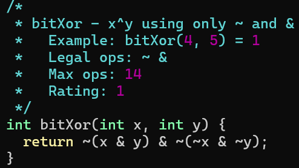
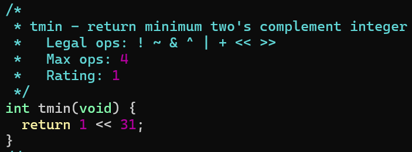
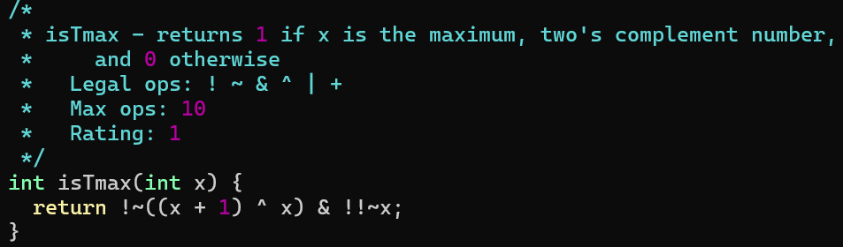
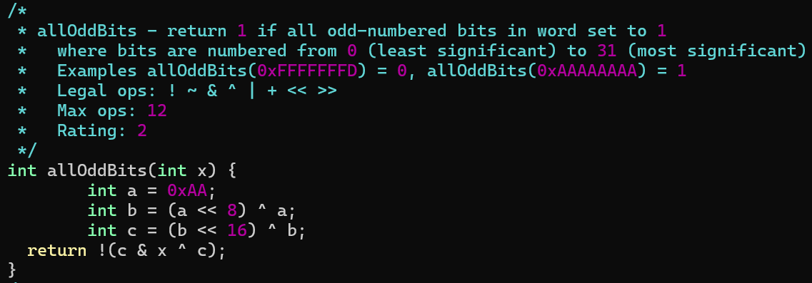
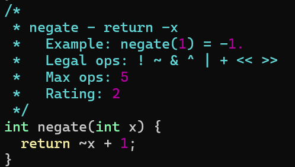
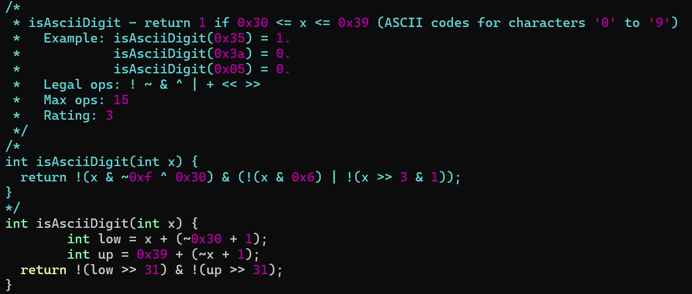

# datalab

### 实验要求

实验目标: 在给定限制下修改 `bit.c` 文件, 通过 btest 测试

实验流程:

1.   修改 bit.c 文件

2.   用 dlc 检查是否符合编码要求

     ```bash
     ./dlc bits.c
     ```

3.   每次修改 bit.c 都得重新编译 btest

     ```bash
     make btest
     ```

4.   测试 bit.c 正确性

     ```bash
     ./btest
     ```

5.   使用 btest (正确性)和 dlc (编码要求)自动评分

     ```
     ./driver.pl
     ```

### bitXor

只用 `~ &` 实现 `^`



**真值表**

先考虑仅 x = 1 y = 1 时输出 1, 即 x & y

在考虑仅 x = 0 y = 0 时输出 1, 即 ~x & ~y

合并上述两个结果 x & y | ~x & ~y

再取反 ~(x & y | ~x & ~y) 

使用德摩根定律 ~ (x & y) & ~(~x & ~y)

| 输入 x | 输入 y | 输出 x ^ y | x & y | ~x & ~y | x & y \| ~x & ~y | ~ (x & y) & ~(~x & ~y) |
| :----: | :----: | :--------: | :---: | :-----: | :--------------: | :--------------------: |
|   0    |   0    |     0      |   0   |    1    |        1         |           0            |
|   0    |   1    |     1      |   0   |    0    |        0         |           1            |
|   1    |   0    |     1      |   0   |    0    |        0         |           1            |
|   1    |   1    |     0      |   1   |    0    |        1         |           0            |

### tmin

返回补码最小值

显然是 1 << 31



### isTmax

判断是否是补码最大值



在四位二进制数下考虑 x = 0111

特点是 + 1 得到最小值, x + 1 = 1000

二者合并得到全 1, (x + 1) ^ x = 1111

将 1111 映射为 1,  !~((x + 1) ^ x)

经过 btest 测试后发现 1111 也符合该情况, 所以需要将其排除

思路是将 1111 映射为 0, 其他映射为 1, 二者相与

~x 能将 1111 映射为 0, 但不能将其他映射为 1

所以需要 !! 来讲非零数映射为 1, 零映射为 0, 即 !!~x

最终结果 !~((x + 1) ^ x) & !!~x

 

### allOddBits

判断 x 奇数位上的数是否全 1



先构造出 `0xAAAAAAAA`

由于限制要求使用 0~255 之间的数

所以先构造 `a = 0xAA`

再构造 `b = (a << 8) ^ a = 0xAAAA`

构造 `c =  (b << 16) ^ b = 0xAAAAAAAA`

取出 x 奇数位上的数 `c & x`

判断是否等于 c,  `!(c & x ^ c)`

### negate

求相反数

经典取反加一



### isAsciiDigit

判断是否是 `'0' ~ '9'`



第一种方法: 位模式

高24位是否是`0x30` `!(x & ~0xf ^ 0x30)`

低 4位是否是 0~9 `!(x & 0x6) | !(x >> 3 & 1)`

第二种方法: 减法

x 减去 0x30, 0x39 减去 x

```C
int low = x + (~0x30 + 1);
int up = 0x39 + (~x + 1);
```

再判断正负 ``!(low >> 31) & !(up >> 31)`