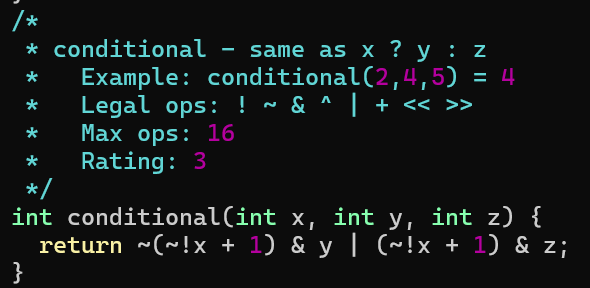
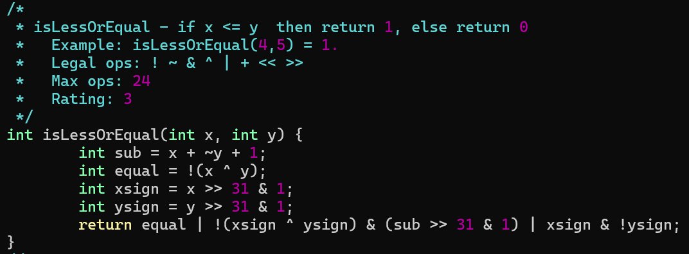
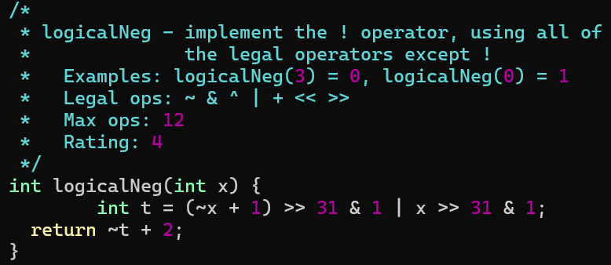
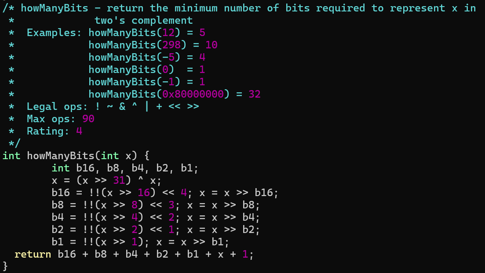
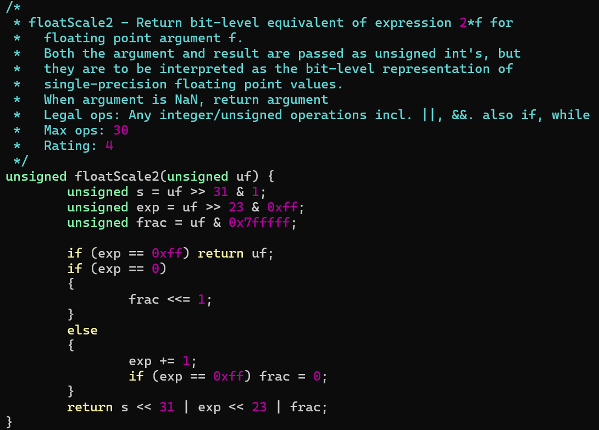
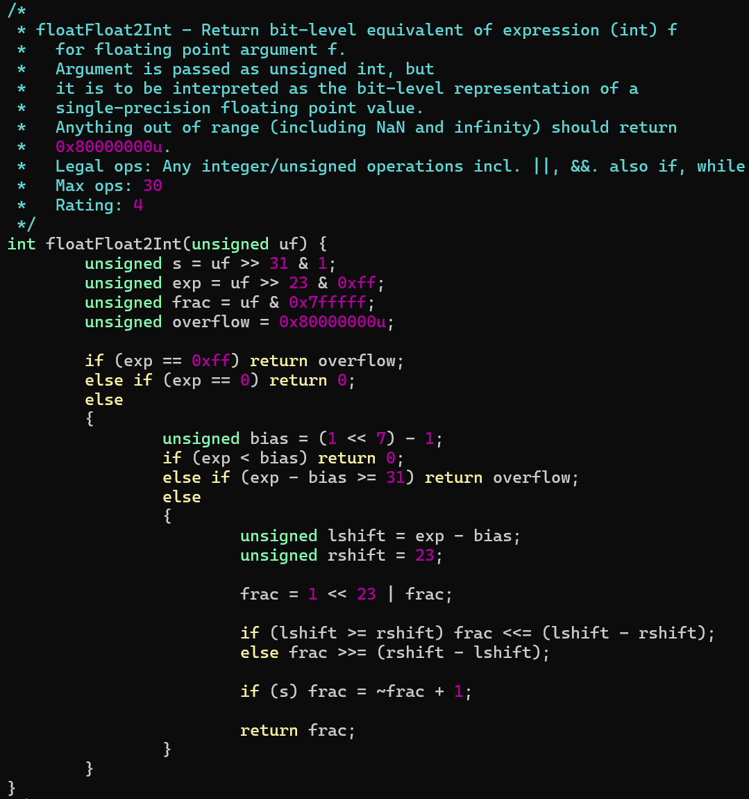
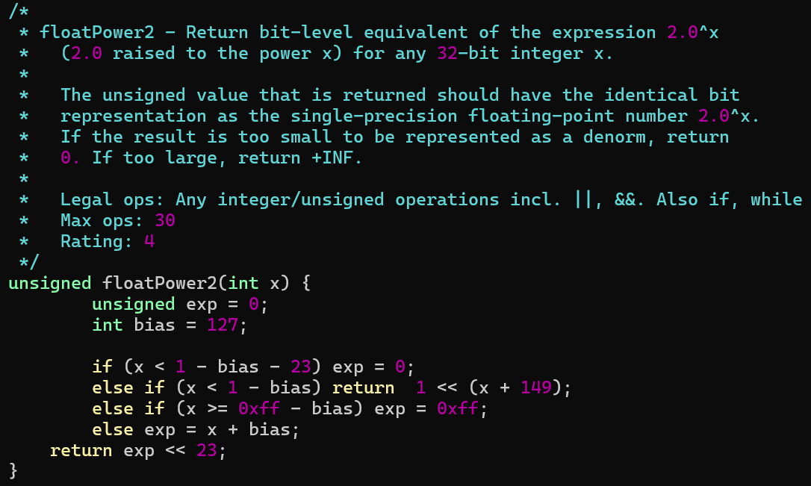

# datalab

### 实验要求

实验资料: https://csapp.cs.cmu.edu/3e/labs.html datalab [Self-Study Handout](https://csapp.cs.cmu.edu/3e/datalab-handout.tar)

实验目标: 在给定限制下修改 `bit.c` 文件, 通过 btest 测试

实验流程:

1.   修改 bit.c 文件

2.   用 dlc 检查是否符合编码要求

     ```bash
     ./dlc bits.c
     ```

3.   每次修改 bit.c 都得重新编译 btest

     ```bash
     make btest
     ```

4.   测试 bit.c 正确性

     ```bash
     ./btest
     ```

5.   使用 btest (正确性)和 dlc (编码要求)自动评分

     ```
     ./driver.pl
     ```

### bitXor

只用 `~ &` 实现 `^`


**真值表**

先考虑仅 x = 1 y = 1 时输出 1, 即 x & y

在考虑仅 x = 0 y = 0 时输出 1, 即 ~x & ~y

合并上述两个结果 x & y | ~x & ~y

再取反 ~(x & y | ~x & ~y) 

使用德摩根定律 ~ (x & y) & ~(~x & ~y)

| 输入 x | 输入 y | 输出 x ^ y | x & y | ~x & ~y | x & y \| ~x & ~y | ~ (x & y) & ~(~x & ~y) |
| :----: | :----: | :--------: | :---: | :-----: | :--------------: | :--------------------: |
|   0    |   0    |     0      |   0   |    1    |        1         |           0            |
|   0    |   1    |     1      |   0   |    0    |        0         |           1            |
|   1    |   0    |     1      |   0   |    0    |        0         |           1            |
|   1    |   1    |     0      |   1   |    0    |        1         |           0            |

### tmin

返回补码最小值

显然是 1 << 31


### isTmax

判断是否是补码最大值


在四位二进制数下考虑 x = 0111

特点是 + 1 得到最小值, x + 1 = 1000

二者合并得到全 1, (x + 1) ^ x = 1111

将 1111 映射为 1,  !~((x + 1) ^ x)

经过 btest 测试后发现 1111 也符合该情况, 所以需要将其排除

思路是将 1111 映射为 0, 其他映射为 1, 二者相与

~x 能将 1111 映射为 0, 但不能将其他映射为 1

所以需要 !! 来讲非零数映射为 1, 零映射为 0, 即 !!~x

最终结果 !~((x + 1) ^ x) & !!~x

 

### allOddBits

判断 x 奇数位上的数是否全 1


先构造出 `0xAAAAAAAA`

由于限制要求使用 0~255 之间的数

所以先构造 `a = 0xAA`

再构造 `b = (a << 8) ^ a = 0xAAAA`

构造 `c =  (b << 16) ^ b = 0xAAAAAAAA`

取出 x 奇数位上的数 `c & x`

判断是否等于 c,  `!(c & x ^ c)`

### negate

求相反数

经典取反加一


### isAsciiDigit

判断是否是 `'0' ~ '9'`


第一种方法: 位模式

高24位是否是`0x30` `!(x & ~0xf ^ 0x30)`

低 4位是否是 0~9 `!(x & 0x6) | !(x >> 3 & 1)`

第二种方法: 减法

x 减去 0x30, 0x39 减去 x

```C
int low = x + (~0x30 + 1);
int up = 0x39 + (~x + 1);
```

再判断正负 ``!(low >> 31) & !(up >> 31)`

### conditional

条件表达式



思路是将 x = 0 转化为全 0, 将 x = 非 0 转化为全 1, 然后分别与 y 和 z 与操作, 再将结果合并

先对 x 进行逻辑非操作 `!x`: x = 0 $\rightarrow$ 1, x = 非 0 $\rightarrow$ 0

考虑到 -1 就是全 1, 0 就是全 0

于是求 1 和 0 的相反数, 也就是取反加一 ``~!x + 1`: x = 0 $\rightarrow$ 1111, x = 非 0 $\rightarrow$ 0000

然后分别与 y 和 z 进行与操作, `~(~!x + 1) & y | (~!x + 1) & z`

### isLessOrEqual

判定 x 是否小于等于 y



sub 表示 x - y 也就是 x + (-y) = `x + ~y + 1`

equal 表示 x y 相等时为 1, `!(x ^ y)`

xsign 表示 x 的符号位 `x >> 31 & 1`

ysign 表示 y 的符号位 `y >> 31 & 1`

case1: x y 相等

case2: 符号位相等且 sub 为负数

case3: x 为负, y 为正

总 `equal | !(xsign ^ ysign) & (sub >> 31 & 1) | xsign & !ysign`

### logicalNeg

实现逻辑非



先将 x = 0 和 x = 非 0 两种情况区分开, 

0 的特点就是相反数也是 0, 或者说 0 及相反数符号位都是 0, 其他的任何数及其相反数符号位必有一个为 1

也就是 `(~x + 1) >> 31 & 1 | x >> 31 & 1` 当 x = 0 时表达式等于 0, 当 x = 非 0 时表达式等于 1

剩下的就是将 t = 0 1 转化为 1 0

显然用 1 - t 即可

也就是 `~t + 2`

### howManyBits

最少需要几位二进制数才能表示 x, 例:

`fun(12) = fun(01100) = 5`

`fun(-5) = fun(1001) = 4`

`fun(0) = fun(-1) = 1`

`fun(0x80000000) = 32`



先将负数和非负数两种情况统一

x = 负数, fun(x) = 最高零位位数 + 1(符号位)

x = 非负数, fun(x) = 最高一位位数 + 1(符号位)

x 为负数和非负数时 x >> 31 = 1111 和 0000

则 (x >> 31) ^ x 就将两种情况统一为计算最高一位位数 + 1(符号位)

对于 `fun(12) = 01100` 就是找到最高一位位数 4 + 1(符号位) = 5

对于 `fun(-1)` 就是先将 x = -1 转化为 0, 然后最高一位位数 0 + 1(符号位) = 1

采用二分思想查找最高位的1

高16位 `b16 = !!(x >> 16) << 4` 

*   高 16 位有 1, 则 b16 = 16, x = x >> b16 = 高 16 位
*   高 16 位无 1, 则 b16 = 0, x = x >> b16 = 低 16 位, 高 16 位不动但后面用不上了

高 8 位 `b8 = !!(x >> 8) << 3`

*   高 8 位有 1, 则 b8 = 8, x = x >> b8 = 上一步所得 16 位中的高 8 位
*   高 8 位无 1, 则 b8 = 0, x = x >> b8 = 上一步所得 16 位中的低 8 位, 高 8 位不动但后面用不上了

以此类推, 

`b4 = !!(x >> 4) << 2; x = x >> b4` 得到 4 位数

`b2 = !!(x >> 2) << 1; x = x >> b2` 得到 2 位数

`b1 = !!(x >> 1); x = x >> b1` 得到 1 位数

b16 = 16/0 表示 32 位的高 16 位是否有 1

b8 = 8/0 表示 16 位的高 8 位是否有 1

b4 = 4/0 表示 8 位的高 4 位是否有 1

b2 = 2/0 表示 4 位的高 2 位是否有 1

b1 = 1/0 表示 2 位的高 1 位是否有 1

若 b1 = 1, 最后的 x 表示 2 位的高 1 位是否有 1, 二者相加为 2

若 b1 = 0, 最后的 x 表示 2 位的低 1 位是否有 1

最终结果 = b16 + b8 + b4 + b2 + b1 + x + 1

### floatScale2

将浮点数 f 乘以 2, 返回其无符号表示形式



**case3: exp全 1 特殊值** 

uf 是无穷大或NaN, 乘2后结果不变, return uf

**case2: exp 全 0 非规格化值**

uf 是非规格化值, 乘2意味着 frac 左移一位, 不用分情况考虑是否溢出到exp

因为如果不溢出, frac 最高位为 0, frac 左移一位能够放下 2*f , exp 部分不变还是全0, 符号位 s 也不变

如果溢出, frac 最高位为 1, 浮点数值为 $f_{\text{移位前}} = (-1)^s \cdot 0.1f_{n-2}\dots f_0  \cdot 2 ^ {1 - Bias}$, 乘以 2 即 frac 左移一位溢出到 exp 部分, 即 exp 为 1, frac 部分为 $f_{n-2}\dots f_00$, 符号位 s 不变, 浮点数值为 $f_{\text{移位后}} = (-1)^s\cdot 1.f_{n-2}\dots f_00 \cdot 2^{1-Bias}$, 显然是移位前浮点数的两倍, 即直接将 frac 左移一位能涵盖溢出到 exp 的情况

即 exp 全 0 时, uf 乘以 2 可直接将 frac 左移一位

**case1: exp 非全 0 非全 1 规格化值**

uf 是规格化值, exp + 1 即意味着乘 2, 考虑 exp + 1 后变为全 1 情况(`0xff`), 此时若 frac 不为零, 结果为 NaN, 显然不对, 应该是无穷大, 所以要将 frac 部分置为 0

即 exp += 1  if (exp == 0xff) frac = 0

综合三种情况, 最后的结果是 `s << 31 | exp << 23 | frac`

### floatFloat2Int

将浮点数强制类型转换为 int



定义溢出情况下返回 `overflow = 0x80000000u` 也就是 `TMin`

**case3: exp全 1 特殊值**

显然返回 overflow

**case2: exp 全 0 非规格化值**

舍弃小数部分, 返回 0

**case1: exp 非全 0 非全 1 规格化值**

Bias = (1 << 7) - 1 = 127

*   exp < Bias 时, E = exp - Bias < 0, 返回 0

*   exp - Bias >= 31 时, E >= 31, 不考虑符号位, 结果 $2^E \cdot 1.frac \ge (1 << 31)$, E = 31 且 frac 部分为 0 时取等号, 此时溢出, 返回 overflow

*   其余情况, 也就是在 int 范围内时, 首先完整表示 frac, 补上隐藏的 1,  即 `frac = 1 << 23 | frac`

    frac 本身是小数部分, 却用 unsigned 表示, 其需要右移 23 位

    E = exp - Bias 表示 frac 需要左移的位数

    左移部分右移部分比较大小, 最终 frac 移位的结果根据符号位 s 来判断是否要取反加一

### floatPower2

2 的 x 次幂浮点数表示



Bias = (1 << 7) - 1 = 127 

**case3: exp全 1 特殊值**

exp = 0xff 时, x = 0xff - bias = 255 - 127 =  128

也就是 x >= 128 超出 exp 的表示范围, 此时 exp = 0xff 表示无穷大, frac 为 0

**case2: exp 全 0 非规格化值**

E = 1 - Bias = -126

frac 部分能表示的最小数为 $2^{-23}$ 此时能表示的最小幂为 -149

frac 部分能表示的最大数为 $2^0$ 此时能表示的最大幂为 -126

所以当 x < 1 - Bias - 23 = -149 时, exp = 0

当  -149 <= x < 1 - Bias = -126 时, 剩余的位数为 x + 149, 即结果为 1 << (x + 149)

**case1: exp 非全 0 非全 1 规格化值**

当 -126 <= x < 128 时, exp = x + Bias, frac 为 0

总的来说当  -149 <= x < 1 - Bias = -126 时, 结果直接计算为 1 << (x + 149), 其余情况确定好 exp 后, 结果为 exp << 23