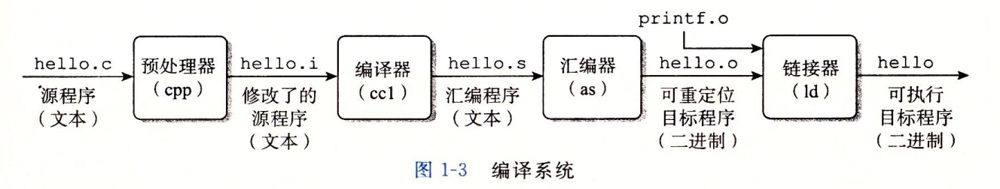
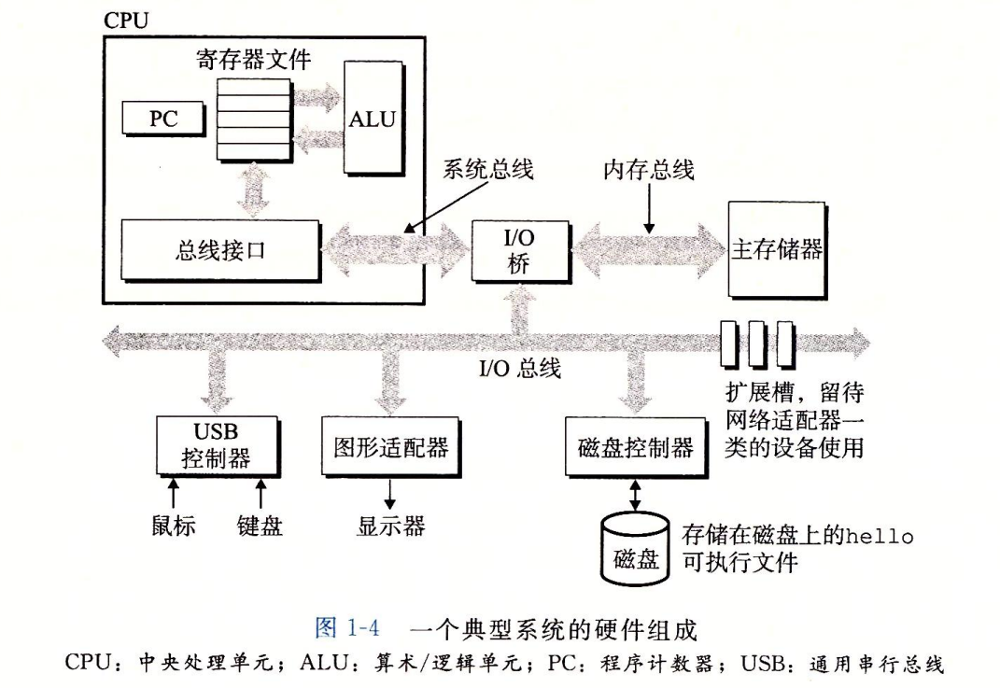
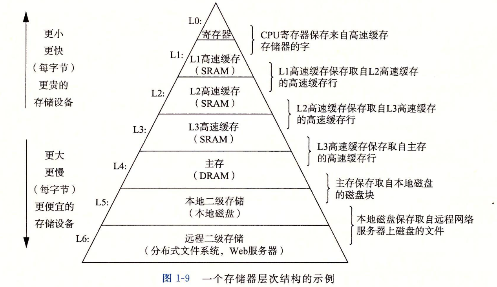
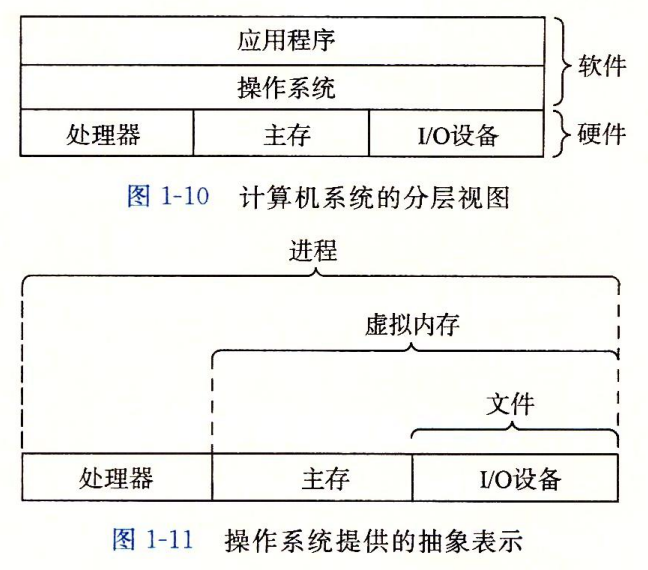
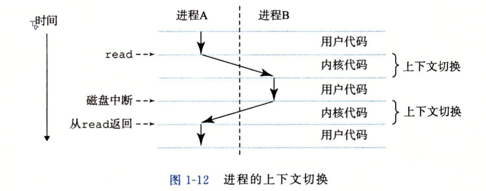
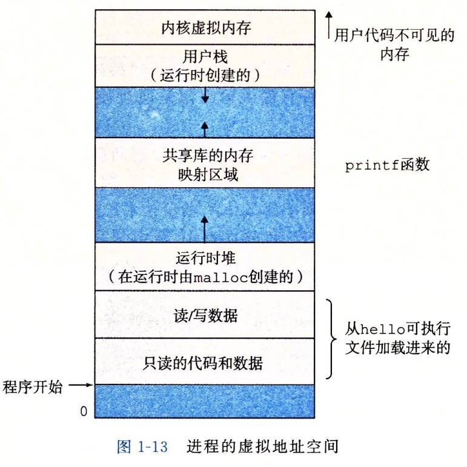
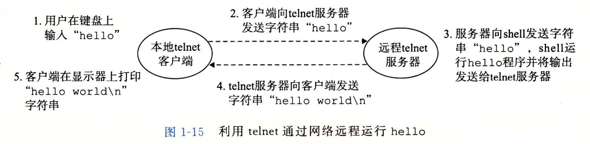
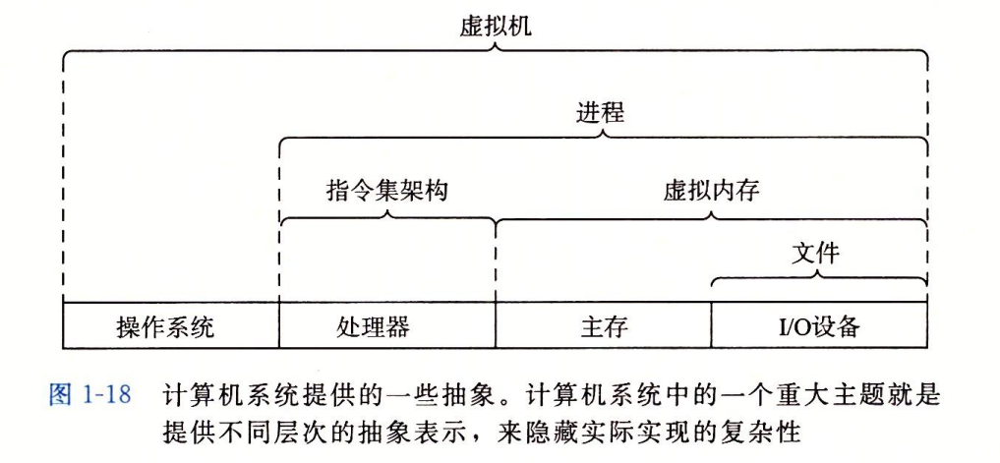

# 第一章: 计算机系统漫游

[TOC]

## 总览

**CSAPP: 从程序员角度了解计算机系统是如何工作的**

*   第一部分: **单个程序**运行在机器上
    *   第二章: 位怎么表示信息
    *   第三章: 汇编指令搬运并计算信息
    *   第四章: 硬件执行汇编指令
    *   第五章: 硬件优化汇编指令
    *   第六章: 信息搬运优化
*   第二部分: **操作系统运行程序**
    *   第七章: 链接多个文件
    *   第八章: 异常控制流: 多程序切换
    *   第九章: 虚拟内存: 都独占内存
*   第三部分: **程序间交互**
    *   第十章: 程序与外设交互
    *   第十一章: 程序与程序交互
    *   第十二章: 并发编程

---

## 第一部分 单个程序

**信息 = 位 + 上下文**

**源程序 $->$ 编译系统 $->$ 可执行文件**

1.   源程序 hello.c
2.   预处理 hello.i
3.   编译 hello.s
4.   汇编 hello.o
5.   链接 hello

**计算机系统**

*   硬件
    *   CPU: 执行汇编指令
    *   总线: 搬运信息
    *   内存: 存储信息
    *   I/O设备: 外部世界交互
*   软件
    *   操作系统

 

**运行 hello 程序**

总线连接不同单元

*   **CPU 和内存**走**系统总线/内存总线**
*   **磁盘和外设**走 **I/O 总线**
*   I/O 桥连接两种总线

1.   "./hello" 键盘 $->$ USB 控制器 $->$ 寄存器 $->$ 内存
2.   回车 $->$ shell 加载 hello 文件
3.   **DMA**: 磁盘 $->$ 磁盘控制器 $->$ 内存
4.   执行 hello 程序 $->$ "hello, world\n" 内存 $->$ 寄存器 $->$ 图形适配器 $->$ 显示器

**高一层存储器作为低一层存储器的高速缓存**

---

## 第二部分 系统运行程序

操作系统面向应用程序提供**统一抽像**来控制硬件

**进程切换**

**虚拟内存: 每个进程独占内存**

虚拟地址空间

*   内核部分
*   栈
*   共享库
*   堆
*   数据
*   代码

---

## 第三部分 程序间交互

线程级并发

指令级并行

单指令多数据并行

---

## Amdahl定律

$$
S = T_{\text{old}} / T_{\text{new}} = \frac{1}{(1 - \alpha) + \alpha / k}
$$

---

## 抽像

