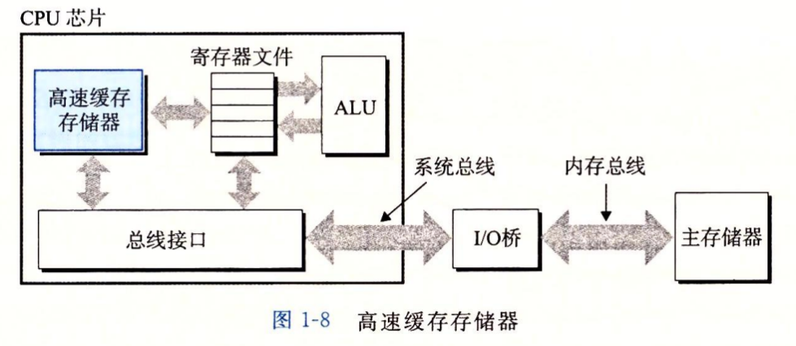
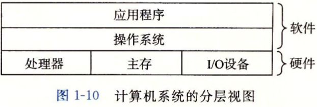
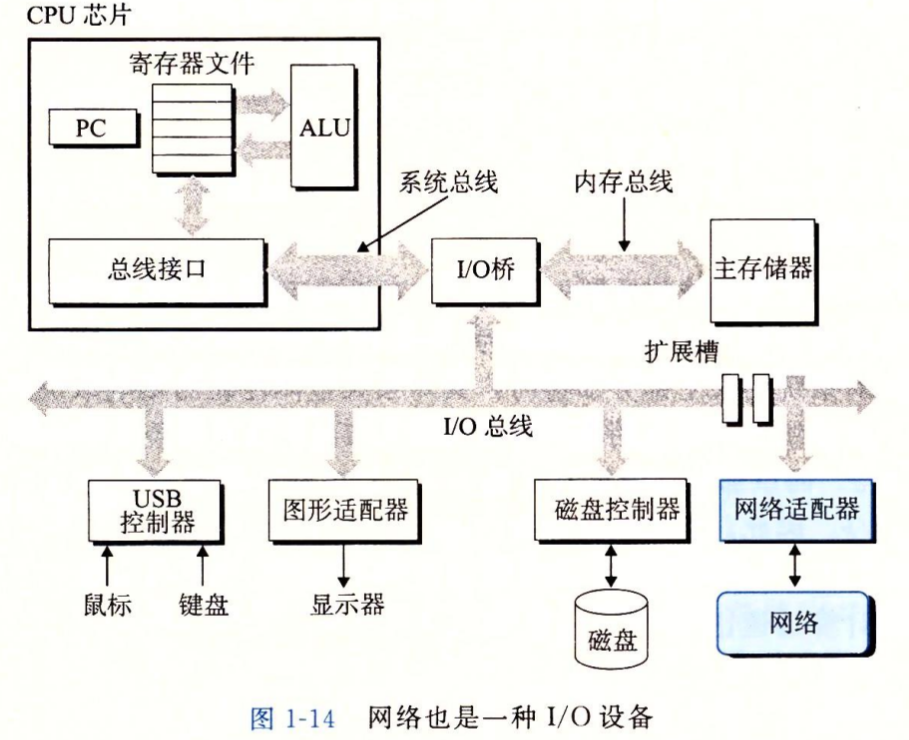

# 第一章: 计算机系统漫游

[TOC]

## 总览

**CSAPP: 从程序员角度了解计算机系统是如何工作的**

*   第一部分: **程序与硬件交互**
    *   第二章: 位表示信息
    *   第三章: 汇编指令
    *   第四章: 硬件执行汇编指令
    *   第五章: 硬件优化汇编指令
    *   第六章: 信息搬运优化
*   第二部分: **程序与操作系统交互**
    *   第七章: 链接
    *   第八章: 异常控制流
    *   第九章: 虚拟内存
*   第三部分: **程序与程序交互**
    *   第十章: 程序与外设交互
    *   第十一章: 程序与程序交互
    *   第十二章: 并发编程

---

## 第一部分 程序与硬件交互

**信息 = 位 + 上下文**

**源程序 $\xrightarrow{\text{编译系统}}$ 可执行文件**


处理器读并解释内存中的指令

```bash
linux> ./hello
hello, world
```

**计算机系统**

*   硬件
    *   CPU: 执行汇编指令
    *   内存: 存储信息
    *   总线: 搬运信息
    *   I/O设备: 外部世界交互通道
*   软件
    *   操作系统


**运行 hello 程序**

1.   shell 读取 ./hello 命令

     >   fork -> execve -> wait

     键盘 -> 寄存器 -> 内存 -> shell

2.   shell 加载 hello 文件

     DMA: 磁盘 -> 内存

3.   CPU 执行 hello 程序

     内存 -> 寄存器 -> 外设

**高速缓存至关重要**



**高一层存储器作为低一层存储器的高速缓存**


---

## 第二部分 程序与操作系统交互

操作系统面向应用程序提供**统一抽像**来控制硬件




**进程上下文切换**

1.   保存当前进程上下文
2.   恢复新进程上下文
3.   控制权移交新进程


**虚拟内存: 每个进程独占内存**

*   内核部分
*   栈
*   共享库
*   堆
*   数据
*   代码


---

## 第三部分 程序与程序交互

**网络是 IO 设备**




**并发与并行**

1.   线程级并发 高层

     *   多核: 每个核单独寄存器, L1 和 L2 缓存, 共享 L3 和内存

     *   超线程: 单核多个控制流. PC 寄存器等硬件有多份, 一份浮点运算单元


2.   指令级并行 中层

     *   流水线

     *   超标量


3.   单指令多数据 SIMD 低层

     特殊硬件让一条指令有多个并行操作

---

## Amdahl定律

$$
S = T_{\text{old}} / T_{\text{new}} = \frac{1}{(1 - \alpha) + \alpha / k}
$$

