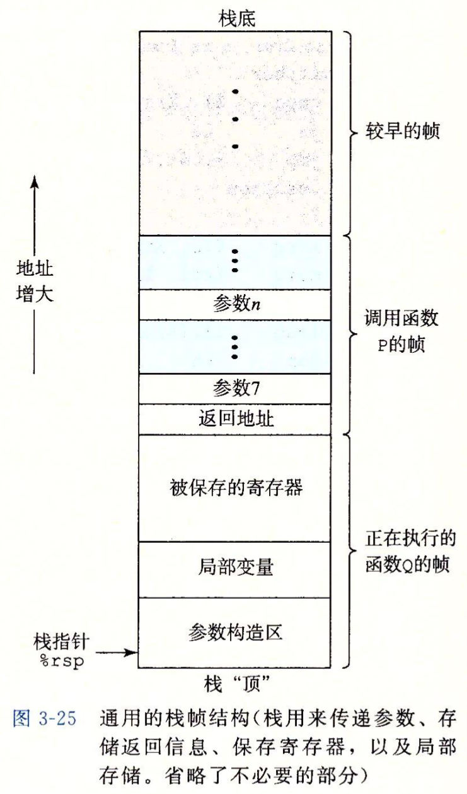
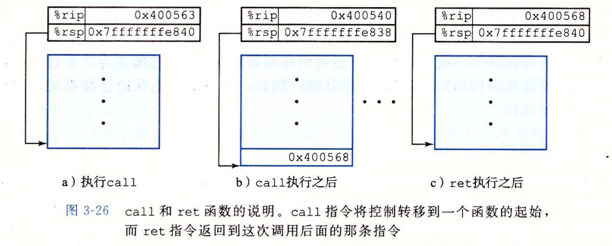
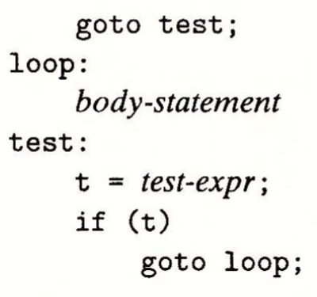

# 第三章 程序的机器级表示

### 编译系统

```bash
# 源文件 p1.c  p2.c
.c -> .i -> .s -> .o -> 可执行文件

# 预处理
gcc -E p1.c -o p1.i
gcc -E p2.c -o p2.i

# 编译
gcc -Og -S p1.i -o p1.s
gcc -Og -S p2.i -o p2.s

# 汇编
gcc -c p1.s -o p1.o
gcc -c p2.s -o p2.o

# 链接
gcc p1.o p2.o -o p

# 反汇编
objdump -d test.o > test.dump	# 反汇编可重定位目标文件
objdump -d test.o > test.dump	# 反汇编可执行目标文件
```

1.   **预处理器 cpp**

     预处理 # 开头的预处理指令

     文本文件 p1.i p2.i

2.   **编译器 cc1**

     编译为汇编代码

     汇编文件 p1.s  p2.s

3.   **汇编器 as**

     汇编为机器代码

     可重定位目标文件 p1.o p2.o

4.   **链接器 ld**

     符号解析和重定位, p1.o  p2.o 与库代码合并

     可执行目标文件 p

### 机器级编程抽象

**ISA 抽象 CPU 的软件可见行为, 包括处理器状态, 指令格式, 指令对状态的影响**

处理器状态: PC, 整数寄存器, 条件码寄存器, 向量寄存器

**虚拟地址空间抽象内存, 磁盘为大数组**

### 数据格式


### 寄存器

16个64位**通用目的寄存器**

*   生成1/2字节数字的指令保持剩余字节不变
*   生成4字节数字的指令把高位4字节置为0


### 操作数

*   基址寄存器 $r_b$ 和变址寄存器 $r_i$ 是 64 位寄存器
*   比例因子 $s$ 是 1 2 4 8

|  类型  |        格式        |                 值                 |
| :----: | :----------------: | :--------------------------------: |
| 立即数 |     $\${Imm}$      |              ${Imm}$               |
| 寄存器 |       $r_a$        |              $R[r_a]$              |
| 存储器 | $Imm(r_b, r_i, s)$ | $M[Imm + R[r_b] + R[r_i] \cdot s]$ |

### 数据传送

普通x86-64指令中两个操作数不能都指向内存

**普通 MOV**

**源操作数指定立即数**(立即数, 寄存器或内存)

**目的操作数指定位置**(寄存器或内存)

*   `movq` 32位立即数扩展到64位
*   `movabsq` 源操作数任意64位立即数, 目的操作数寄存器


**扩展 MOV**


### 算数和逻辑操作

**leaq 计算地址给寄存器**

移位操作

*   移位量: 立即数或寄存器 `%cl`
*   目的操作数: w 位长, 移位量为低 `log w` 位, 忽略高位


特殊算术操作

乘法 `%rax * 源操作数 -> %rdx : %rax`

除法 `%rdx : %rax / 源操作数 -> 商%rax 余数%rdx `

`%rdx`

*   无符号除法 `xorl %edx, %edx`
*   有符号除法 `cqto`


### 控制

**条件码**

一组单个位的条件码寄存器, 描述最近算术/逻辑操作的属性

*   CF 进位标志

*   ZF 零标志

*   SF 符号标志

*   OF 溢出标志

**设置条件码**


**缩写**

无符号比较: below / above

有符号比较: less / great

|  缩写   |          含义           |     符号      |
| :-----: | :---------------------: | :-----------: |
|  e / z  |     equal / zero ==     |               |
| ne / nz | not equal / not zero != |               |
|         |                         |               |
|    b    |         below <         |    无符号     |
|   be    |     below equal <=      |    无符号     |
|    a    |         above >         |    无符号     |
|   ae    |     above equal >=      |    无符号     |
|         |                         |               |
|    l    |         less <          |    有符号     |
|   le    |      less equal <=      |    有符号     |
|    g    |         great >         |    有符号     |
|   ge    |     great equal >=      |    有符号     |
|         |                         |               |
|    c    |     carry 进位/借位     |  setb = setc  |
|   nc    |  no carry 无进位/借位   | setae = setnc |
|         |                         |               |
|    s    |         sign 负         |               |
|   ns    |      no sign 非负       |               |
|         |                         |               |
|    o    |      overflow 溢出      |               |
|   no    |   no overflow 无溢出    |               |

**访问条件码**


**跳转指令**

*   相对地址

    下一指令地址 + 偏移量

*   绝对地址

    四字节


**条件分支**

```c
	if (!expr)
    	goto false;
	...
	goto done;
false:
	...
done:
```

**条件传送**

直接计算两种结果, 根据条件二选一

```C
if ()
    res = ...;
else
    res = ...;
```

预测错误概率 $p$, 预测正确时间 $T_{OK}$, 预测错误处罚 $T_{MP}$, 平均时间 $T_{avg}$
$$
T_{avg}(p) = T_{OK} + pT_{MP}
$$
从目的寄存器推断操作数长度


**循环**

**do-while**

```C
loop:
	...
    if (expr)
        goto loop;
```


**while**

```C
	goto test;
loop:
	...
    if (expr)
        goto loop;
```

```C
	if (expr)
        goto done;
loop:
	...
    if (expr)
        goto loop;
done:
```

**for**

```C
for (init; expr; update)
    
init;
while (expr)
{
    ...
    update;
}
```

**switch**

```C
static void *jt[n] = {
    &&loc_A, &&loc_B, &&loc_C, &&loc_D,
    &&loc_E, &&loc_D, &&loc_def
};

unsigned idx = ... - ...;

if (expr)
    goto loc_def;
goto *jt[idx];

loc_A:
	...
...
loc_F:
	...
loc_def:
	...
```










 


