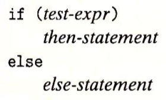
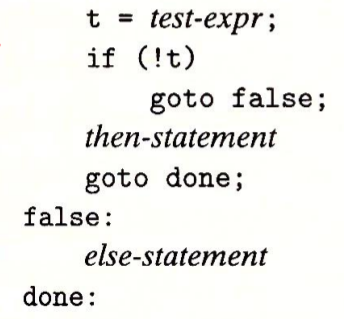
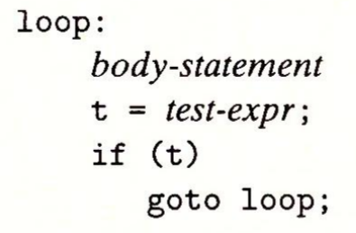
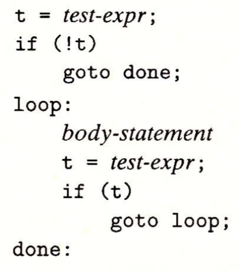

# 第三章 程序的机器级表示

```bash
gcc -Og -S test.c	# 汇编代码 test.s
gcc -Og -c test.c	# 目标代码 test.o
gcc -Og -o test main.c test.c	# 可执行代码 test
```

```bash
objdump -d test.o	# 反汇编 test.s
```

>   Optimize generate Assembly output

8位-字节

16位-字

32位-双字

64位-四字


|  类型  |        格式        |                 值                 |
| :----: | :----------------: | :--------------------------------: |
| 立即数 |     $\${Imm}$      |              ${Imm}$               |
| 寄存器 |       $r_a$        |              $R[r_a]$              |
|  内存  | $Imm(r_b, r_i, s)$ | $M[Imm + R[r_b] + R[r_i] \cdot s]$ |

**MOV 类**

movl 寄存器为目的时将高位4字节置为0


**算数和逻辑操作**


leaq 目的操作数是寄存器

移位量是立即数或寄存器 cl, w位长移位量为 cl 低 $\log w$ 位


CF 进位标志

ZF 零标志

SF 符号标志

OF 溢出标志


跳转目标地址 = 跳转指令下一条指令的地址 + 偏移量

**if**






**do-while**



**while**





 


