# 第三章 程序的机器级表示 

### 编译系统

```bash
# 源文件 p1.c  p2.c
.c -> .i -> .s -> .o -> 可执行文件

# 预处理
gcc -E test.c -o test.i

# 编译
gcc -Og -S test.i -o test.s

# 汇编
gcc -c test.s -o test.o

# 链接
gcc test.o -o p

# 反汇编
objdump -d test.o > test.dump	# 反汇编可重定位目标文件
objdump -d test > test.dump	# 反汇编可执行目标文件
```

1.   **预处理器 cpp**

     文本文件

2.   **编译器 cc1**

     汇编文件

3.   **汇编器 as**

     可重定位目标文件

4.   **链接器 ld**

     符号解析和重定位

     可执行目标文件

### 机器级编程抽象

**ISA 抽象 CPU 的软件可见行为, 包括处理器状态, 指令格式, 指令对状态的影响**

处理器状态: PC, CC, 程序寄存器, 内存

### 数据格式

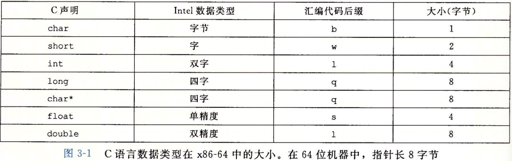

### 寄存器

16个64位**通用目的寄存器**

*   生成低4字节值时把高4字节置为0

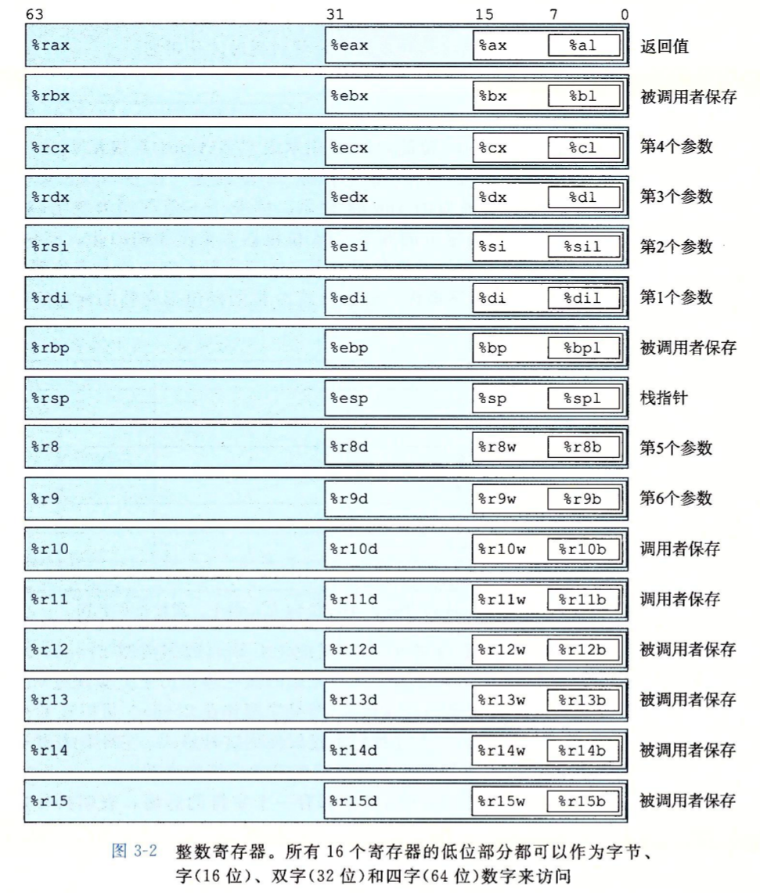

### 操作数

*   基址寄存器 $r_b$ 和变址寄存器 $r_i$ 是 64 位寄存器
*   比例因子 $s$ 是 1 2 4 8

|  类型  |        格式        |                 值                 |
| :----: | :----------------: | :--------------------------------: |
| 立即数 |     $\${Imm}$      |              ${Imm}$               |
| 寄存器 |       $r_a$        |              $R[r_a]$              |
| 存储器 | $Imm(r_b, r_i, s)$ | $M[Imm + R[r_b] + R[r_i] \cdot s]$ |

### 数据传送

**普通 MOV**

*   `movq` 32位立即数符号扩展到64位
*   `movabsq` 源操作数任意64位立即数, 目的操作数寄存器

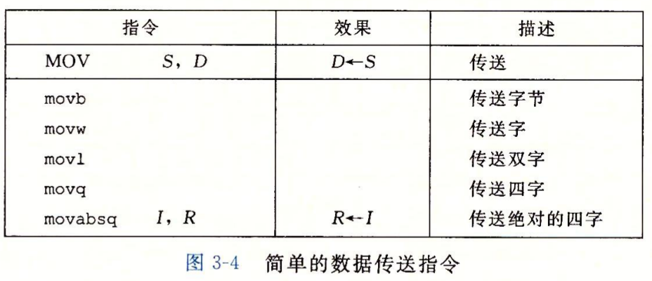

**扩展 MOV**

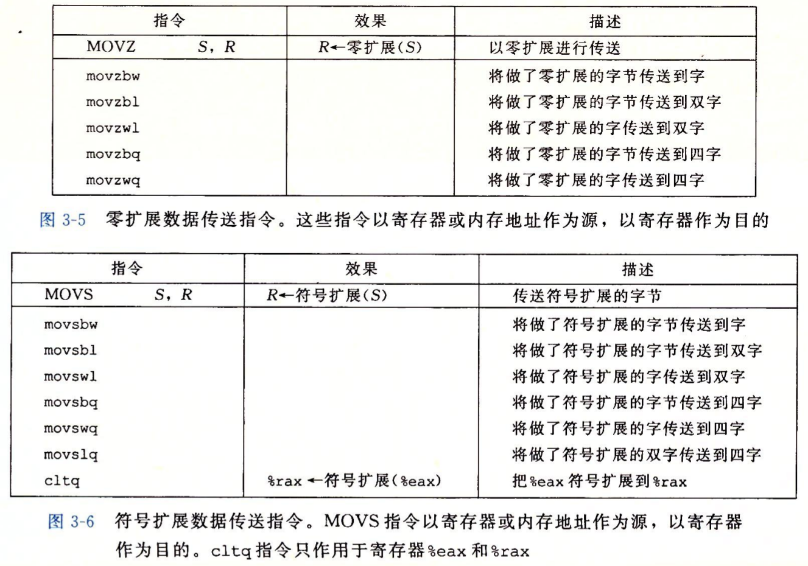

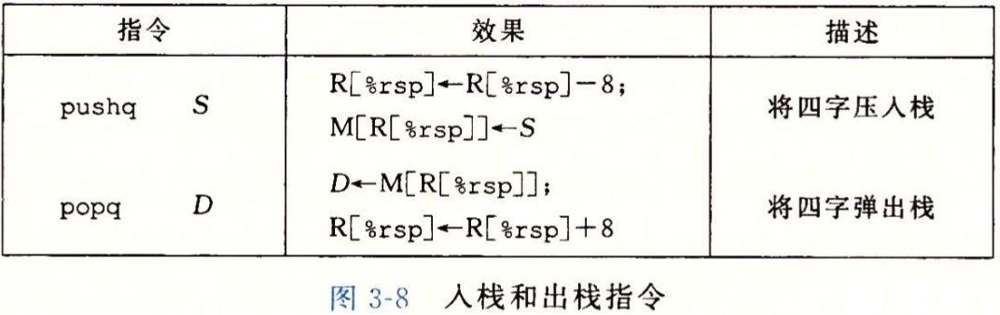

### 算数和逻辑操作

**leaq 计算地址给寄存器**, 不设置 CC

移位操作

*   移位量: 立即数或寄存器 `%cl`
*   目的操作数: w 位长, 移位量为低 `log w` 位, 忽略高位

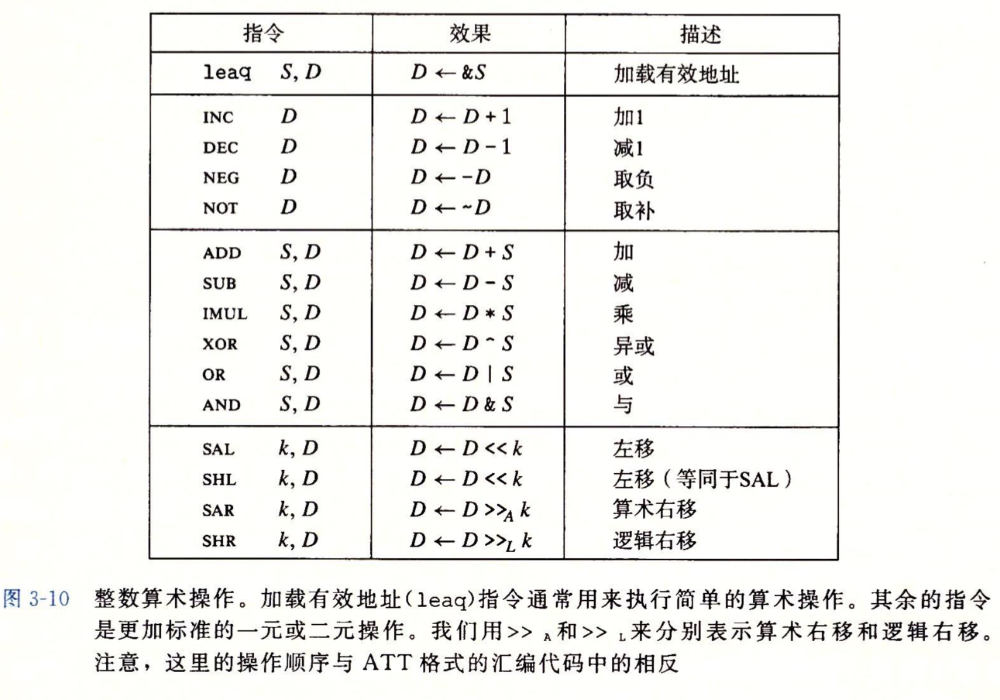

特殊算术操作

64 位乘法 `%rax * 源操作数 -> %rdx : %rax`

64 位除法 `%rdx : %rax / 源操作数 -> 商%rax 余数%rdx `

*   零扩展 `%rdx`  `xorl %edx, %edx`
*   符号扩展 `%rdx`  `cqto`

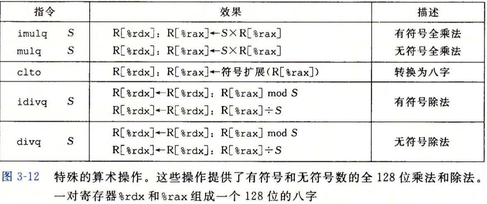

### 控制

**缩写**

无符号比较: below / above

有符号比较: less / great

进位/借位 carry

符号 sign

零 zero

溢出 overflow

**条件码寄存器**

*   CF 进位

*   ZF 零

*   SF 符号

*   OF 溢出

**设置条件码寄存器**

cmp $S_2 - S_1$

test $S_1 \& S_2$

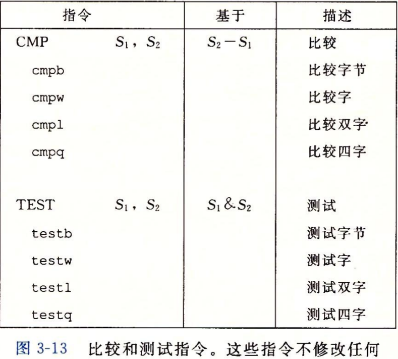

**访问条件码寄存器**

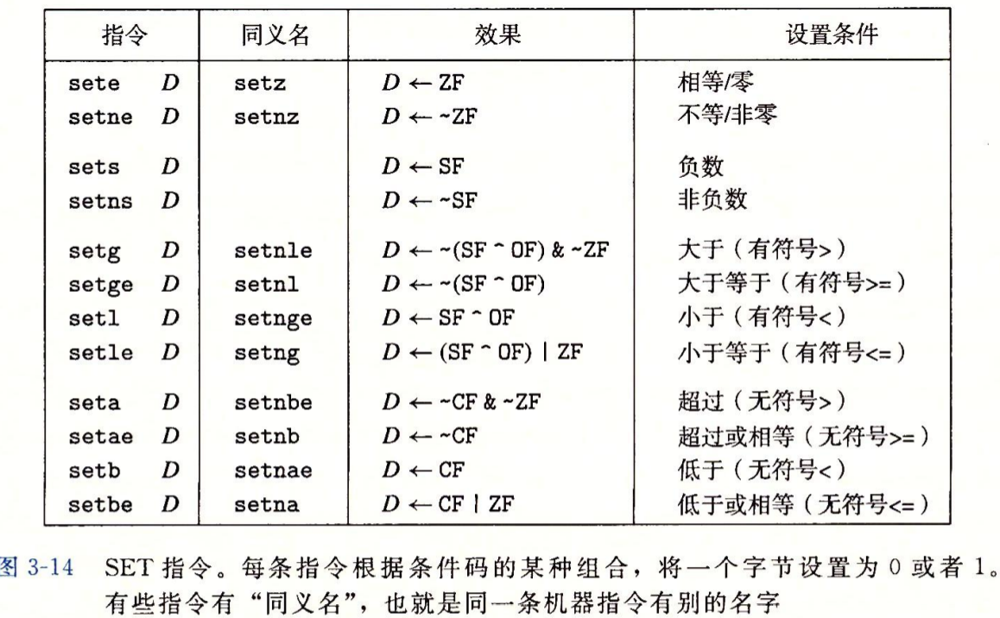

**跳转指令**

*   相对地址

    下一指令地址 + 偏移量

*   绝对地址

    四字节

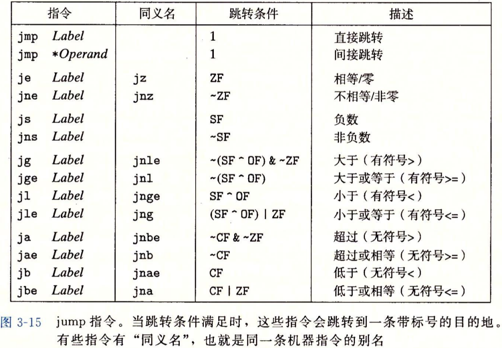

**条件分支**

```c
	if (!expr)
    	goto false;
	...
	goto done;
false:
	...
done:
```

**条件传送**

直接计算两种结果, 根据条件二选一

```C
if (expr)
    res = ...;
else
    res = ...;
```

预测错误概率 $p$, 预测正确时间 $T_{OK}$, 预测错误处罚 $T_{MP}$, 平均时间 $T_{avg}$
$$
T_{avg}(p) = T_{OK} + pT_{MP}
$$
从目的寄存器推断操作数长度

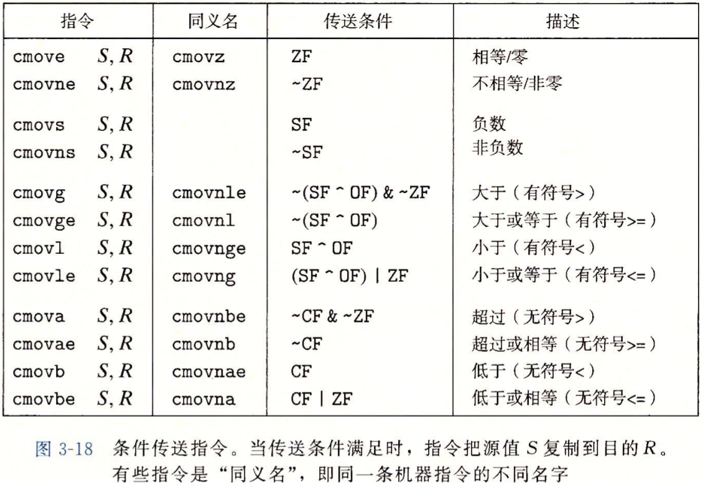

**循环**

**do-while**

```C
loop:
	...
    if (expr)
        goto loop;
```

**while**

```C
	goto test;
loop:
	...
test:
    if (expr)
        goto loop;
```

```C
	if (!expr)
        goto done;
loop:
	...
    if (expr)
        goto loop;
done:
```

**for**

```C
for (init; expr; update)
    
init;
while (expr)
{
    ...
    update;
}
```

**switch**

```C
static void *jt[n] = {
    &&loc_A, &&loc_B, &&loc_C, &&loc_D,
    &&loc_E, &&loc_D, &&loc_def
};

unsigned idx = ... - ...;

if (expr)
    goto loc_def;
goto *jt[idx];

loc_A:
	...
...
loc_F:
	...
loc_def:
	...
```

### 过程

栈帧作用

*   传递控制
*   传递数据
*   分配和释放内存

**运行时栈**

栈帧以调用为单位

*   叶子函数且参数<=6个, 局部变量+临时变量只占用**调用者保存寄存器**, 有调用, 无栈帧
*   内联函数直接展开, 无调用, 无栈帧
*   尾调用优化复用当前栈帧, 不开新栈帧

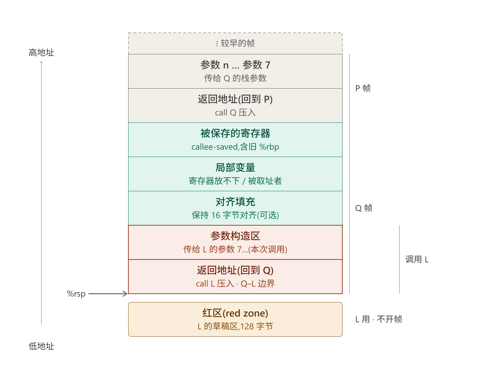

**控制转移**

call

*   压栈 P 的执行代码地址
*   设 PC 为 Q 的起始代码地址

ret

*   出栈得到 P 的执行代码位置并设为 PC 值

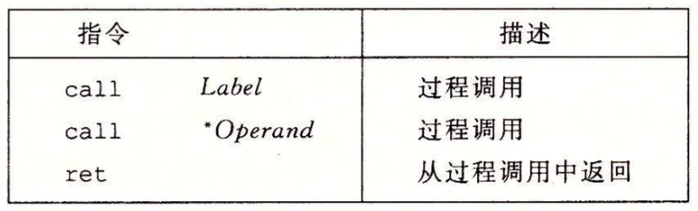

**数据传送**

栈传送参数向8对齐

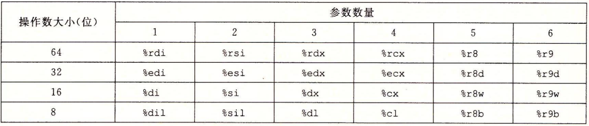 

局部变量保存在内存栈:

*   寄存器不够用
*   地址运算符 `&`
*   数组或结构体

局部变量保存在寄存器:

被调用者保存寄存器 `%rbx %rbp %r12 ~ %r15`


**数组访问**
$$
\&A[i][j] = x_A + L(C\cdot i + j)
$$
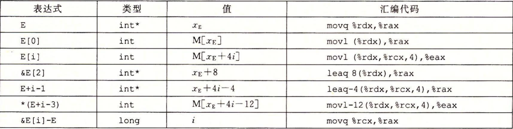

编译器优化多维数组访问: 地址计算由**索引乘法**变成**固定步长指针递增加法**

*   指令减少: 多乘法多加法 -> 少加法
*   依赖链: 计算解耦, CPU 能提前计算, 从**乘法依赖到加法依赖**

**定长数组**

优化前

```C
#define N 16
for (int j = 0; j < N; j++)
    result += A[i][j] * B[j][k];
```

两次mov, 两次移位, 三次加法

```assembly
rdi = A  rsi = B  rdx = i  rcx =  k
r8 = j

loop:
	mov rdx, r9
	sal 4, r9		
	add r8, r9				# 16i + j
	mov (rdi, r9, 4), r10	# A[i][j]
	
	mov r8, r9
	sal 4, r9
	add rcx, r9				# 16j + k
	mov (rsi, r9, 4), r11	# B[j][k]
	
	add 1, r8
	cmp 16, r8
	jl .loop
```

优化后

```C
int *R = &A[i][0];
int *C = &B[0][k];
int *Cend = &B[N][k];

do
{
    result += *R * *C;
    R++;
    C += N;
} while (C != Cend);
```

两次加法

```assembly
rdi = A  rsi = B  rdx = i  rcx =  k

    sal 6, rdx			# 64i
    add rdx, rdi		# R = &A[i][0]
    lea (rsi, rcx, 4), rsi	# C = &B[0][k]
    lea 1024(rsi), rcx	# Cend = C + 16 * 16 * 4
.loop:
	mov (rdi), r9		# *R
	mov (rsi), r10		# *C
	
	add 4, rdi			# R++
	add 64, rsi			# C += N
	
	
	cmp rcx, rsi
	jne .loop
```

**变长数组**

优化前

```C
for (int j = 0; j < n; j++)
    result += A[i][j] * B[j][k];
```

两次 mov, 两次乘法, 三次加法

```assembly
rdi = n  rsi = A  rdx = B  rcx =  i  r8 = k
r9 = j
    
.loop:
	mov rdi, r10
	imul rcx, r10	# n * i
	add r9, r10		# n * i + j
	mov (rsi, r10, 4), r11	# A[i][j]
	
	mov rdi, r10
	imul r9, r10	# n * j
	add r8, r10		# n * j + k
	mov (rdx, r10, 4), r12# B[j][k]
	
	add 1, r9
	cmp rdi, r9
	jl .loop
```

优化后

```C
int *R = &A[i][0];
int *C = &B[0][k];
int *Cend = &B[n][k];

do
{
    result += *R * *C;
    R++;
    C += n;
} while (C != Cend);
```

两次加法

```assembly
rdi = n  rsi = A  rdx = B  rcx =  i, r8 = k

    imul rdi, rcx
    lea (rsi, rcx, 4), rsi	# R = &A[i][0]
    lea (rdx, r8, 4), rdx	# C = &B[0][k]
    mov rdi, rax
    imul rax, rax
    lea (rdx, rax, 4), r8	# Cend = &B[n][k]
    lea (,rdi, 4), rdi		# 4n

.loop:
	mov (rsi), r9			# *R
	mov (rdx), r10			# *C
	
	add 4, rsi				# R++
	add rdi, rdx			# C += n
	
	cmp r8, rdx
	jne .loop
```

**数据对齐原则**: 任何 K 字节基本对象的地址必须是 K 的倍数

函数指针

```C
int (*fp)(int, int *);
int fun(int x, int y);

fp = fun;
fp(1, 2);
```

**变长栈帧**

*   帧指针

    ```assembly
    push rbp		# 被调用者保存寄存器
    mov rsp, rbp	# 当前栈顶地址作为帧指针地址
    ```

*   栈 16 字节对齐, 数组首地址对齐

    ```assembly
    lea 22(,rdi,8), rax		# 8n + 7(首地址对齐余量) + 15
    and -16, rax			# 16对齐, 申请 rax 大小空间
    
    sub rax, rsp			# 申请空间
    lea 7(rsp), rax			
    shr 3, rax				# 数组首地址 8 * rax
    ```

*   leave

    变长栈帧函数结尾一次性恢复 rsp rbp

    ```assembly
    mov rbp, rsp
    pop rbp
    ```

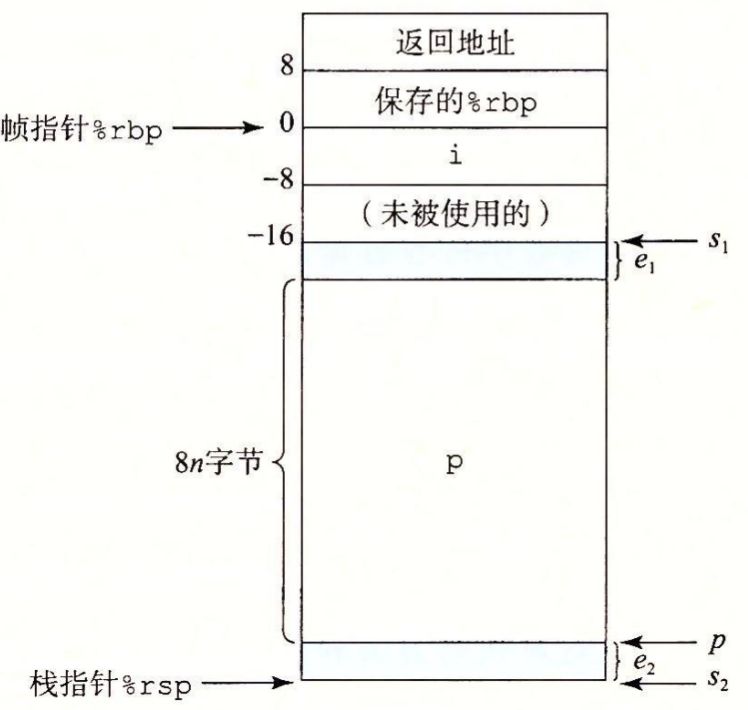

**GDB**

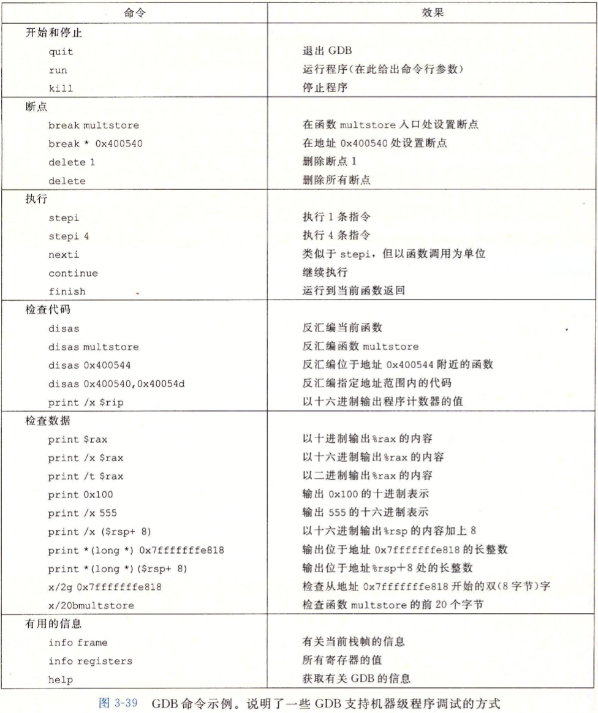

缓冲区溢出: 覆盖栈上重要信息

防范:

*   栈随机化
*   栈破坏检测
*   限制可执行代码区域

