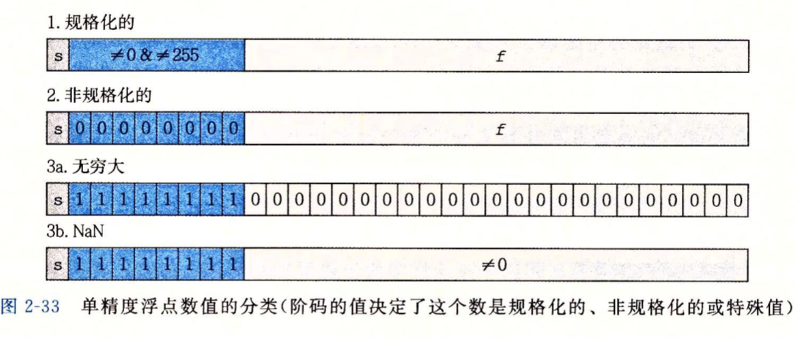

# 第二章 信息的表示和处理

## 信息存储

**信息 = 位 + 上下文**

*   无符号编码: 非负数模运算

*   补码编码: 有负数模运算

*   浮点数编码: 科学计数法

大端法最高字节在低地址

小端法最低字节在低地址

## 整数表示

无符号编码 = $\sum_{i=0}^{w-1} x_i 2^i$

补码编码 = $- x_{w-1} 2^{w-1} + \sum_{i=0}^{w-2} x_i 2^i$

$$
\begin{align*}
\mathrm{T2U}_w(x) &= \begin{cases} x + 2^w, & x < 0 \\ x, & x \geq 0 \end{cases} \\[2ex]
\mathrm{U2T}_w(u) &= \begin{cases} u, & u \leq \mathrm{TMax}_w \\ u - 2^w, & u > \mathrm{TMax}_w \end{cases}
\end{align*}
$$
算术右移与符号扩展补符号位

`unsigned (short x) == (unsigned) (int) x`

## 整数运算

无符号运算: $[0, 2^w-1]\mod 2^w$

补码运算: $[-2^{w-1}, 2^{w-1}-1]\mod 2^w$

模数加法是阿贝尔群, 模数乘法是幺半群, 两者合起来 $(\mathbb{Z}_{2^w}, +, \times)$ 是环

*   **封闭性**

*   **交换律, 结合律**

*   **单位元**

*   **逆元**

    *   无符号
        $$
        -x =
        \begin{cases}
        0, & x = 0 \\
        2^{w} - x, & x > 0
        \end{cases}
        $$

    *   有符号
        $$
        -x =
        \begin{cases}
        TMin_w, & x = TMin_w \\
        -x, & x > TMin_w
        \end{cases}
        $$

溢出检测

```C++
unsigned s = x + y;
return s < x || s < y;

int s = x + y;
return x > 0 && y > 0 && s <= 0 || x < 0 && y < 0 && s >= 0;
```

除以2的幂

*   无符号 = 右移
*   补码 = `(x < 0 ? x + (1 << k) - 1 : x) >> k`

    >   向零取整

## 浮点数

**不满足结合律, 向偶数舍入**

单精度 exp = 8 位 frac = 23 位

双精度 exp = 11 位 frac = 52 位
$$
V = (-1)^s \times M \times 2^E
$$
*   符号 $s$
*   尾数 $M$ 二进制小数, 由 $frac =f_{n-1}\dots f_1f_0$  编码
*   阶码 $E$ 权重 $2^E$, 由 $exp = e_{k-1}\dots e_1 e_0$ 编码

>   $Bias = 2^{k-1} -1$

**规格化值**
$$
M = 1 + 0.frac \\
E = exp - Bias \\
$$
**非规格化值**

$exp = 0$
$$
M = 0.frac\\
E = 1 - Bias
$$

**特殊值**

$exp 全1$

*   $frac = 0$ 时表示无穷大
*   $frac \ne 0$ 时表示 $NaN$



