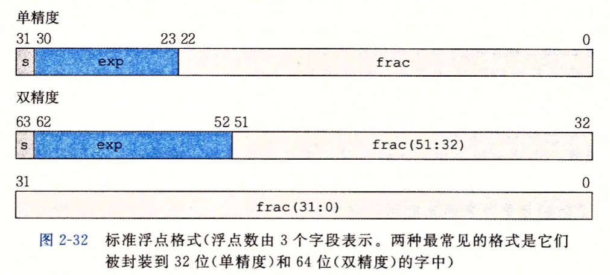

# 第二章 信息的表示和处理

无符号编码: 二进制

补码编码: 符号位

浮点数编码: 科学计数法

## 信息存储

`0x01234567`

大端法: 最高有效字节在前

`01 23 45 67`

小端法: 最低有效字节在前

`67 45 23 01`

```C++
void swap(int &a, int &b)
{
    a = a ^ b;
    b = a ^ b;
    a = a ^ b;
}
```

逻辑右移补0

算数右移补符号位

## 整数表示

无符号编码 = $\sum_{i=0}^{w-1} x_i 2^i$

补码编码 = $- x_{w-1} 2^{w-1} + \sum_{i=0}^{w-2} x_i 2^i$

类型转换: 位不变, 解释方式改变

## 整数运算

二进制运算后截断位再解释

溢出检测

```C++
bool check_u(unsigned x, unsigned y)
{
    unsigned s = x + y;
    return s < x || s < y;
}

bool check_t(int x, int y)
{
    int s = x + y;
    return x > 0 && y > 0 && s <= 0 || x < 0 && y < 0 && s >= 0;
}
```

## 浮点数

$$
V = (-1)^s \times M \times 2^E
$$

单精度

*   exp = 8 位
*   frac = 23 位

双精度

*   exp = 11 位
*   frac = 52 位



规格化值
$$
E = exp - Bias \\
Bias = 2^{k-1} -1 \\
f = 0.frac \\
0 \leq f < 1 \\
M = 1 + f
$$
非规格化值

>   0 与 接近 0 的数

$$
E = 1 - Bias \\
M = f
$$


舍入

*   向上舍入
*   向下舍入
*   向零舍入
*   向偶数舍入

浮点运算无结合律